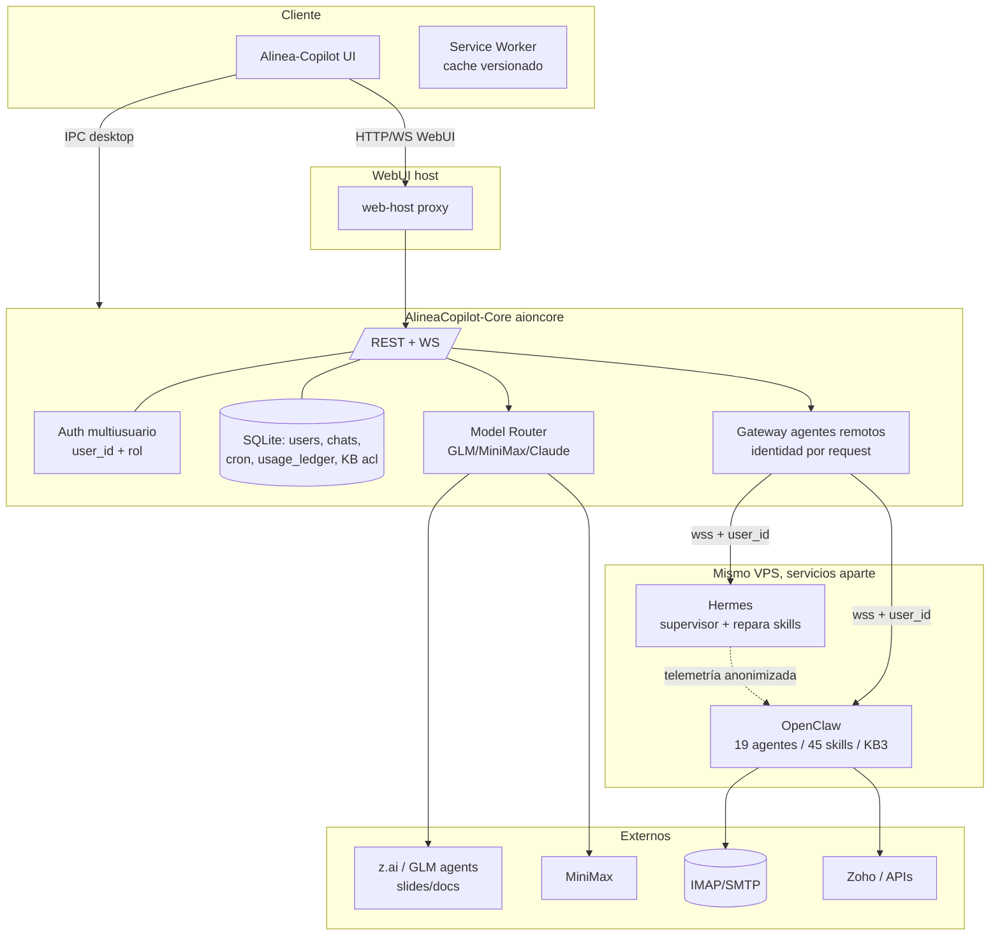
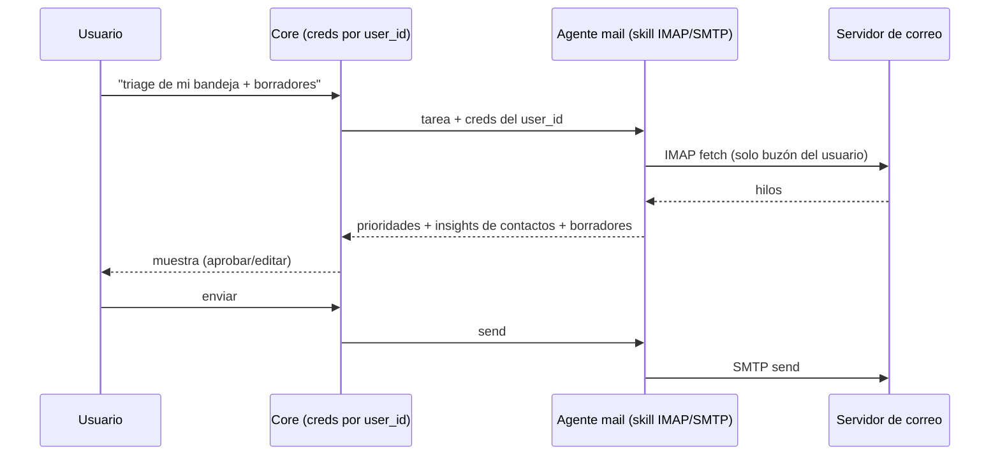
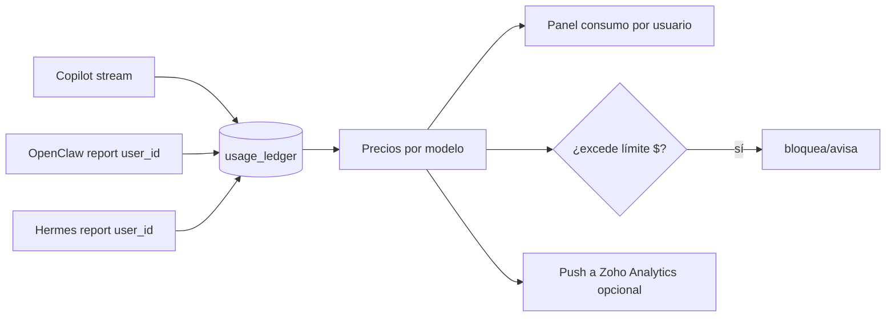
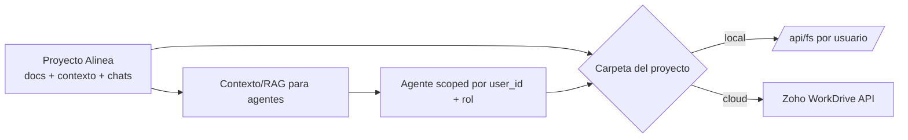
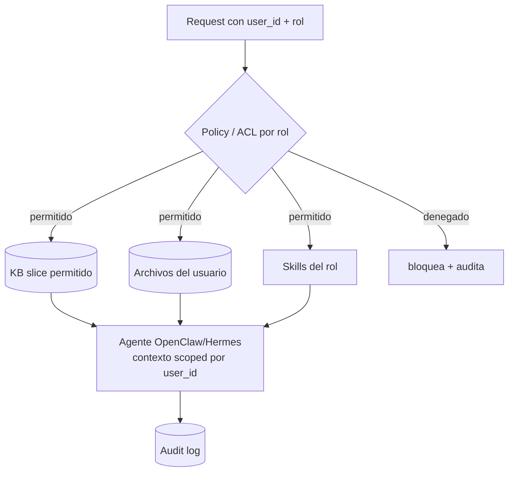

# Alinea Copiloto — Roadmap y conceptualización técnica (v2)

> Documento de trabajo para revisar con Claude Code (y con el equipo de Core/OpenClaw).
> Resume **lo pedido**, **lo ya hecho**, **cómo encaja todo** a través de los 3 repos, la
> comunicación end-to-end, y **decisiones + dudas restantes** por feature.
>
> v2 incorpora las respuestas del 16-jun a las 8 dudas + dos temas nuevos:
> **segregación de datos multiusuario** y **command center de agentes**.
> Estado: borrador para discusión. No implementa nada nuevo; solo conceptualiza.

---

## 0. TL;DR (con decisiones tomadas)

| Feature | Decisión | Dónde vive | Complejidad |
| --- | --- | --- | --- |
| **GLM (z.ai) + MiniMax** | Router de modelos + agentes de documento/slides de z.ai; MiniMax para tareas baratas/largas; **templates de marca** (calidad "diseñador gráfico") | Core (router/adapters) + Frontend (assistant + preview) + plantillas | Media-Alta |
| **Hermes** | Servicio aparte en el mismo VPS que **mejora UX y repara skills** (supervisor); se conecta como agente remoto | Servicio Hermes + Core (gateway) + Frontend (command center) | Media-Alta |
| **Agentic Mail** | Completo: insights de contactos, prefiltro/triage, respuestas profesionalizadas. **IMAP/SMTP** para integrar cualquier proveedor | Skill/MCP (OpenClaw o Core) + creds por usuario | Alta |
| **Todos / Knowledge** | Producto tipo **Notion**: tareas + docs + **base de conocimiento visible** y consultable por agentes; conecta cualquier API | Core (módulo workspace/KB) + Frontend (módulo nuevo) | Alta |
| **Proyectos + carpetas cloud** | **Proyectos persistentes** estilo Claude (docs/contexto/chats) + carpetas **Zoho WorkDrive**; unificar el "Work in a project" hoy escondido en WebUI | Core (entidad proyecto) + Frontend + conector WorkDrive | Alta |
| **Visor DXF** | **DXF** (no DWG): visor + **medición** para asesores/técnicos sin AutoCAD | Frontend (cliente) | Media |
| **Consumos $** | Atribución de **$/tokens por usuario** a través de **3 motores** (Copilot/OpenClaw/Hermes) vía ledger unificado | Core (ledger + reporte de agentes) + Frontend (panel) | Alta |
| **Command Center** | Panel de gestión de agentes/gateways (montar `RemoteAgentManagement` y extender) | Frontend + Core | Media |
| **Segregación multiusuario** 🔐 | **Nuevo crítico**: aislar datos por usuario/rol en agentes compartidos (OpenClaw/Hermes) | Transversal (Core + agentes + Frontend) | Alta |
| **Core PR #2 DELETE user** | **OK de merge confirmado** | AlineaCopilot-Core (Rust) | Baja-Media |

---

## 1. Los 3 repos y sus roles

| Repo | Rol | Lenguaje | Notas |
| --- | --- | --- | --- |
| **Alinea-Copilot** (este) | Frontend desktop + WebUI | TS/React/Arco + Electron | Empaqueta `aioncore`. UI, IPC bridge, providers, preview, settings. |
| **AlineaCopilot-Core** | Backend `aioncore` | Rust | Auth multiusuario, SQLite, `/api/*`, orquestación ACP, gateway OpenClaw, preview office, providers. |
| **Alinea-OpenClaw** | Agentes OpenClaw | workspace de agentes/skills | Fuente de verdad: `openclaw-agent/workspace/` (19 agentes, 45 skills, **KB3** en `references/`). Se hornea con `Dockerfile.openclaw`. Se conecta como agente remoto (gateway). |
| **Hermes** (nuevo) | Servicio supervisor | (por definir) | Hosteado en el mismo VPS, **proceso aparte**. Mejora UX y repara skills de OpenClaw/Hermes. Se conecta como agente remoto. |

> Sincronización: el `top-level openclaw/` ya se eliminó (`df42cf8`); fuente única `openclaw-agent/workspace/`. **No tocar `openclaw-agent/`** salvo que se pida. Este repo (Alinea-Copilot) **no** contiene `openclaw/`.

---

## 2. Arquitectura objetivo (cómo se comunicará todo)

Claves del modelo objetivo:

- **La identidad del usuario (`user_id` + rol) viaja en cada request** UI → Core → gateway → agente. Es la base tanto de **segregación** (§9) como de **atribución de consumo** (§4.6).
- **Router de modelos** en el Core: elige el modelo/agente más barato que cumpla la calidad por subtarea (MiniMax barato/largo, GLM agents para documentos diseñados, Claude para razonamiento).
- **OpenClaw y Hermes** son servicios aparte en el mismo VPS, conectados como **agentes remotos** (gateway, handshake Ed25519). Hermes además **observa y repara** skills.

---

## 3. Lo ya hecho / en PR (frontend)

| PR | Tema | Estado |
| --- | --- | --- |
| #1, #5, #8, #9 | Rebrand Alinea, consolidación, de-branding, "Copilot" en home | merged |
| #6 | Curación de asistentes | merged |
| **#10** | "Aion CLI" → "Copilot" en Settings → Agents + i18n | abierta (draft) |
| **#11** | Service Worker auto-update (cache versionado por build) | abierta (draft) |
| **#12** | Este documento de planificación | abierta (draft) |

Pendientes concretos:
- **Core PR #2** `DELETE /api/admin/users/{id}` → **CONFLICTING** (repo Rust). **Merge aprobado por el usuario.** Falta: confirmar permiso de escritura en Core + resolver el conflicto (es Rust) en una corrida dedicada sobre ese repo.
- **Iconos SO** (`.icns`/`.ico` + PWA + tray) desde el PNG Alinea de alta resolución (falta el asset).

---

## 4. Features — deep dive (con decisión)

### 4.1 GLM (z.ai) + MiniMax — documentos "de diseñador" y eficiencia de tokens

**Decisión:** aprovechar **agentes especializados de z.ai** (p. ej. el de slides — https://docs.z.ai/guides/agents/slide — y documentos) + **MiniMax** para abaratar, sin sacrificar calidad. Prioridad: documentos que **parezcan diseñados por un diseñador gráfico**, cada tipo con su estructura propia.

**Cómo logra eficiencia + calidad:**
- Los **agentes de z.ai** generan el artefacto **diseñado del lado servidor** (slides/doc) y devuelven el archivo/HTML estructurado → **no se queman tokens** emitiendo todo el formato en el chat. El modelo de chat solo orquesta (brief → agente → resultado).
- **Router por subtarea:** MiniMax para extracción/borrador/long-context barato; GLM agents para el "render" final diseñado; Claude para razonamiento técnico crítico. Regla: *el más barato que cumpla la calidad objetivo.*
- **Capa de diseño de marca:** plantillas Alinea (paleta Sage Green, Poppins) + **plantillas por tipo de documento** ("lo que lleva cada uno"): propuesta comercial, memoria técnica, BOM, informe gerencial, etc. El agente rellena la plantilla → consistencia visual garantizada.

**Encaje por repo:**
- **Core:** adaptadores z.ai (agents API) y MiniMax; **router** de modelos; almacenamiento del artefacto generado.
- **Frontend:** assistant(s) "Documentos"/"Slides"; preview (reusa el panel de preview, ver §4.5); selector de plantilla.
- **Plantillas:** brand kit + plantillas por tipo (idealmente versionadas en repo o en la KB).

**Dudas restantes:**
- ¿Lista inicial de **tipos de documento** y su estructura (qué lleva cada uno)?
- ¿Plantillas como HTML/tema (export PDF) o como plantillas nativas de z.ai slides?
- ¿Quién decide el modelo (router automático) o el usuario elige "barato vs. máxima calidad"?

---

### 4.2 Hermes — servicio supervisor que mejora UX y repara skills

**Decisión:** Hermes vive **en el mismo VPS, como servicio aparte**, y su misión es **mejorar constantemente la experiencia** y **corregir skills** (de Hermes y OpenClaw). Se conecta como **agente remoto** (gateway).

**Cómo encaja:**
- **Conexión:** `RemoteAgentConfig` (protocol gateway, `wss://`, handshake Ed25519). Se administra desde el **Command Center** (§4.7).
- **Rol supervisor:** Hermes consume **telemetría** (errores de skills, ratings, fallos de tareas) y propone/aplica fixes a skills. ⚠️ Debe operar sobre **datos anonimizados/agregados**, nunca sobre contenido confidencial de usuarios (ver §9).
- **Perfil único / multiusuario:** hoy Hermes y OpenClaw corren bajo **un solo perfil** y atienden a varios usuarios. Esto es exactamente el problema de §9 — se resuelve **propagando `user_id`+rol por request** y **aislando datos por usuario** (no por proceso).

**Dudas restantes:**
- ¿Hermes **aplica** fixes a skills automáticamente o **propone** y un admin aprueba (recomendado: human-in-the-loop al inicio)?
- ¿Hermes tiene UI propia (otro "agent space") o solo vive en el Command Center como servicio?
- ¿Qué telemetría exacta puede ver (y qué NO, por confidencialidad)?

---

### 4.3 Agentic Mail — triage, insights de contactos, respuestas profesionalizadas

**Decisión:** mail agéntico **completo**: prefiltro/triage de correos, **insights de contactos importantes**, respuestas **profesionalizadas**. Integración por **IMAP/SMTP** (fácil con cualquier proveedor).

**Cómo encaja:**
- **Capa de ejecución:** skill/MCP de correo (IMAP read + SMTP send). Reutilizable por agentes.
- **Capacidades:** (a) triage/clasificación + priorización; (b) **memoria de contactos** (quién es importante, historial, contexto) — alimenta y se alimenta del CRM/KB; (c) borradores profesionalizados (human-in-the-loop: aprueba/edita/envía).
- **Disparadores:** on-demand (chat) + **cron** (`ICronJob`) para triage periódico.
- **Credenciales por usuario:** IMAP/SMTP (o OAuth donde aplique) cifradas **por usuario** en el Core (ver §9). Nunca compartidas entre usuarios.

**Dudas restantes:**
- ¿IMAP con app-password, o OAuth para Gmail/Outlook/Zoho (más seguro)?
- ¿"Insights de contactos" se guardan en la KB/CRM (¿cuál?) o memoria propia del mail?
- ¿Nivel de autonomía inicial: solo borradores (recomendado) vs. auto-envío con reglas?

---

### 4.4 Todos / Knowledge — producto tipo Notion + KB visible para agentes

**Decisión:** un producto **tipo Notion**: gestión de **tareas** + **docs** + **base de conocimiento**, con IA para generación y almacenamiento, **consultable por los agentes** como conocimiento, y que **conecta con cualquier tool que tenga API**. Motivo: hoy la **KB vive escondida en el VPS** (la `KB3` de OpenClaw) y no se ve.

**Cómo encaja (módulo nuevo, el más grande):**
- **Visibilizar la KB:** exponer `openclaw-agent/workspace/references/KB3` (y futuros docs) en la UI: navegar, buscar, editar, versionar. Hoy es invisible.
- **Knowledge como fuente para agentes (RAG/MCP):** los agentes consultan la KB vía un endpoint/MCP con **control de acceso por rol** (ver §9) — no todo es visible para todos.
- **Tareas (todos):** dos capas — (a) **todos del agente** (plan que va tachando durante una tarea, render en chat) y (b) **gestor de tareas del usuario** tipo Notion (CRUD, vistas).
- **Conectores:** "conecta cualquier API" → framework de conectores/MCP (Zoho, Notion, Drive, etc.).
- **Almacenaje de docs:** los documentos generados (§4.1) se guardan aquí y quedan como conocimiento.

**Encaje por repo:** Core (módulo workspace/KB + ACL + búsqueda/embeddings) + Frontend (módulo Notion-like) + conectores (MCP).

> Relacionado: **§4.8 Proyectos** es el **contenedor** de todo esto (un proyecto agrupa tareas + docs + conocimiento + chats).

**Dudas restantes:**
- ¿KB **propia** (almacén en Core con búsqueda/embeddings) o **integración** con Notion/Zoho como backend?
- ¿Edición de KB desde la UI escribe de vuelta a `KB3` (repo OpenClaw) o a un almacén separado del Core? (afecta el flujo de "hornear" con Docker).
- ¿Qué conectores primero (Zoho Projects/WorkDrive)?
- Granularidad de permisos de la KB (por documento, carpeta, rol).

---

### 4.5 Visor DXF — para asesores/técnicos sin AutoCAD (con medición)

**Decisión:** **DXF** (el ingeniero lo exporta a DXF). Visor para **visualizar y medir**, dirigido a asesores/técnicos **sin AutoCAD**. (DWG queda fuera por ahora.)

**Cómo encaja (frontend puro):**
1. Añadir `'cad'` (o `'dxf'`) a `PreviewContentType` (`common/types/office/preview.ts`).
2. Mapear `dxf` en `FILE_EXTENSION_MAP` (`Preview/fileUtils.ts`).
3. `DxfViewer.tsx` en `Preview/components/viewers/` con `dxf-parser` + canvas/Three.js: pan/zoom, **toggle de capas**, y **herramienta de medición** (distancia/cota). Ramificar en `PreviewPanel.tsx`.

**Dudas restantes:**
- ¿Solo medición de **distancia**, o también área/ángulos/cotas?
- ¿Unidades del DXF (mm/m) — leerlas del header o configurables?
- ¿Adjuntan el DXF al chat (preview) o se sube a la KB/workspace?

---

### 4.6 Consumos en $ — atribución por usuario a través de 3 motores

**Decisión:** medir en **$** por usuario. Reto declarado: un usuario consume tokens de **Copilot (aionrs)**, **OpenClaw** y **Hermes** — hay que **atribuir todo a ese usuario**.

**Diseño — ledger unificado (clave: identidad por request):**
- **Regla de oro:** *toda* llamada a LLM, sin importar el motor, emite un **usage event** etiquetado con `user_id`, `engine` (aionrs/openclaw/hermes), `model`, `provider`, tokens in/out.
  - **Copilot (aionrs):** el Core ya ve el stream → mete el evento directo.
  - **OpenClaw / Hermes (remotos):** el **protocolo del gateway debe incluir un reporte de uso por request**, con el `user_id` originador. Si usan **llaves de Alinea vía el Core** (recomendado), el Core mide directo; si usan **sus propias llaves**, deben **reportar** el uso.
- **Tabla de precios por modelo** (config) → `cost` estimado por evento.
- **Agregación** por usuario/modelo/motor/fecha → panel admin (reusa Settings → Users) + vista "mi consumo".
- **Límites en $** por usuario (hard=bloquea / soft=avisa), período mensual con reset.

**Dudas restantes:**
- ¿OpenClaw/Hermes usan **llaves de Alinea** (Core mide) o **propias** (deben reportar)? — define cuánta instrumentación hace falta en el gateway.
- ¿Costo **estimado** (tabla local) o **real** (si el provider lo expone)?
- ¿Límite por usuario, por rol, o por equipo? ¿hard/soft?

---

### 4.7 Command Center de agentes (gestión)

**Decisión:** **sí** — un **panel de gestión** estilo "command center" para agentes/gateways.

**Cómo encaja:**
- **Montar** `RemoteAgentManagement.tsx` (hoy **huérfano**) y extenderlo a un centro de control: lista de agentes/gateways (OpenClaw, Hermes), **estado/salud**, **aprobación de devices** (handshake), **uso por agente** (de §4.6), **logs/errores**, y para Hermes: **gestión/aprobación de fixes de skills** (§4.2).
- Acceso **solo admin** (gating por rol, como el panel de Users).

**Dudas restantes:**
- ¿Qué métricas/health quieres ver por agente (latencia, tasa de error, tareas activas)?
- ¿El command center también dispara acciones (reiniciar gateway, recargar skills)?

---

### 4.8 Proyectos (estilo Claude Projects) + carpetas cloud (Zoho WorkDrive)

**Pedido:** "carpetas de proyectos" como **Claude Projects** (un proyecto con documentos/contexto que la IA usa entre chats) y carpetas traídas de **Zoho WorkDrive**, etc. Sensación de que "está escondido".

**Qué existe hoy (y por qué se siente escondido):**
- Hay un selector "**Work in a project**" en la home (`GuidWorkspaceFootnote.tsx`): elige una **carpeta de trabajo por conversación** (`workspaceDir`) donde el agente opera, con "recientes" en localStorage.
- ⚠️ **Limitación clave:** usa el **diálogo nativo** (`ipcBridge.dialog.showOpen`), que **solo funciona en desktop (Electron)**. En **WebUI** queda inservible/escondido → por eso se construyó aparte el `DirectorySelectionModal` (browse/mkdir vía `/api/fs/*` con root por usuario). **No están unificados.**
- Es una **carpeta efímera por chat**, NO un **Proyecto persistente** con documentos/contexto reutilizable entre chats (lo que pides estilo Claude).

**Qué falta (la decisión):**
- **Proyecto como entidad persistente** (no por chat): nombre, descripción, **documentos/carpetas asociados**, **contexto/instrucciones** del proyecto, y los **chats** que le pertenecen. La IA usa los docs del proyecto como contexto (RAG) — igual que Claude Projects.
- **Carpetas cloud:** un proyecto puede mapear a una carpeta **local** o a **Zoho WorkDrive** (u otro cloud) vía API; el agente lee/escribe ahí.
- **Unificar** el selector WebUI/desktop: que "Work in a project" use el mismo picker `/api/fs/*` en WebUI.

**Relación con otras piezas:**
- Es el **contenedor** natural del módulo Notion-like/KB (§4.4): Proyecto = tareas + docs + conocimiento + chats.
- **Segregación (§6):** los proyectos se **scopean por usuario/rol** (un técnico no ve el proyecto de gerencia). Las carpetas WorkDrive heredan permisos por proyecto/rol.
- **Conectores:** WorkDrive es el primer conector de "carpetas"; mismo framework que otros (Drive, etc.).

**Dudas restantes:**
- ¿Proyecto = entidad nueva en el Core (tabla `projects` + relación chats/docs), o se apoya 100% en Zoho WorkDrive como backend de carpetas?
- ¿Los documentos del proyecto alimentan automáticamente la KB/RAG del proyecto (contexto), como Claude Projects?
- ¿WorkDrive por usuario (OAuth) o cuenta de org compartida con permisos por proyecto?
- ¿Unificamos ya el "Work in a project" para que funcione en WebUI (mismo picker `/api/fs/*`)?

---

## 5. (movido) — gestión de agentes remotos

Ver **§4.7 Command Center**. Recordatorio técnico: `RemoteAgentManagement.tsx` existe pero **no está montado** (`AgentModalContent` solo muestra "Local Agents" y redirige `?tab=remote → local`). Montarlo es prerequisito de Hermes/OpenClaw administrables.

---

## 6. 🔐 Segregación de datos y seguridad multiusuario (NUEVO — crítico)

**El problema (tu duda):** OpenClaw (y Hermes) atienden a **varios usuarios** bajo **un solo perfil**. ¿Cómo evitar que mezclen/compartan información confidencial — p. ej. datos de **gerencia** con un **técnico**?

**Principio central: aislar por _identidad_, no por _proceso_.** El servicio puede ser compartido, pero **cada request lleva `user_id` + rol** y **todo acceso a datos se filtra por esa identidad**.

### 6.1 Capas de aislamiento

| Capa | Cómo se aísla |
| --- | --- |
| **Identidad** | `user_id` + rol autenticado viaja UI → Core → gateway → agente en **cada** request. El agente nunca asume "el usuario"; lo recibe. |
| **Conversaciones/chat** | Ya particionadas por `user_id` en SQLite del Core. |
| **Archivos/workspace** | Root **por usuario** (ya iniciado con el folder picker). El agente solo accede al scope del solicitante. |
| **Base de conocimiento** | **KB partida**: *global/compartida* (skills públicas, normas) vs *por rol/usuario* (confidencial). Recuperación con **ACL por rol** — el agente solo recupera lo que el rol permite. |
| **Memoria del agente** | **Namespaced por `user_id`** (sin store de memoria global que mezcle usuarios). |
| **Skills/tools** | **Scoping por rol**: skills de *gerencia/financiera* restringidas; el set disponible depende del rol. |
| **Secretos** | Creds (mail, APIs) cifradas **por usuario** en el Core; nunca compartidas. |
| **Contexto por request** | Cada invocación recibe un contexto **fresco y scoped** (archivos del usuario, slice de KB permitido, creds del usuario) y termina; sin fuga entre requests. |
| **Auditoría** | Log de quién accedió a qué (especialmente datos confidenciales). |

### 6.2 RBAC (roles/grupos)

- Roles base hoy: `admin` / `member`. **Falta** un modelo más rico para "gerencia / técnico / comercial / financiera…" (alineado con las 6 categorías de OpenClaw).
- Propuesta: **grupos/roles** con etiquetas de **clasificación** en docs/skills (`public`, `interno`, `confidencial-gerencia`, `confidencial-financiera`…). La recuperación de KB y la disponibilidad de skills filtran por esas etiquetas vs. el rol del solicitante.

### 6.3 Hermes supervisor (caso especial)

- Hermes mejora skills observando telemetría: debe trabajar sobre **datos anonimizados/agregados** (errores, ratings) — **no** sobre contenido confidencial de los usuarios. Cualquier "ejemplo" para reparar un skill debe ser sintético o explícitamente no confidencial.

### 6.4 Dudas/decisiones de seguridad (para Claude Code)

1. ¿Modelo de roles: mantenemos `admin/member` + **grupos** (gerencia/técnico/…) o roles de primera clase?
2. ¿Clasificación de KB/skills por **etiquetas** (recomendado) y mapeo etiqueta→roles?
3. ¿El gateway de OpenClaw/Hermes **ya** propaga identidad por request, o hay que extender el protocolo? (depende del Core/OpenClaw).
4. ¿Memoria de los agentes: dónde vive y cómo se namespacea por usuario?
5. ¿Cifrado de secretos por usuario: KMS, libsodium/age, o columna cifrada en SQLite?
6. ¿Requisitos de auditoría/compliance (retención de logs, export)?

> **Nota:** la mayor parte de §6 se decide y se implementa en el **Core** y en el **protocolo del gateway** (OpenClaw/Hermes). El frontend aporta: gating por rol (ya existe para admin), UI de grupos/roles, UI de clasificación de KB, y el command center.

---

## 7. Roadmap por fases (orden por dependencias, sin estimaciones de tiempo)

**Fase A — Cierre en vuelo (frontend):**
- Merge #10, #11. Iconos SO (falta PNG). **Core PR #2 (DELETE user)** — merge aprobado; requiere permiso de escritura + resolver conflicto Rust.

**Fase B — Identidad y modelos (cimientos de todo):**
- 🔐 **Propagación de identidad por request** + base de **segregación** (§6) — habilita consumos y mail seguros. *(Core + gateway)*
- **Router de modelos** GLM(z.ai)/MiniMax/Claude + assistant "Documentos/Slides" + plantillas de marca (§4.1).
- **Montar Command Center** (§4.7) → desbloquea Hermes/OpenClaw administrables.

**Fase C — Agentes y productividad:**
- **Hermes** wiring como agente remoto + supervisor (§4.2).
- **Agentic Mail** (IMAP/SMTP, creds por usuario, triage/insights/borradores) (§4.3).

**Fase D — Knowledge, proyectos y documentos:**
- **Proyectos persistentes + carpetas cloud (Zoho WorkDrive)** (§4.8); **unificar** el "Work in a project" para que funcione en WebUI.
- **Módulo Notion-like + KB visible** y consultable por agentes con ACL (§4.4) — incluye visibilizar `KB3`.
- **Visor DXF** con medición (§4.5). Confirmar preview/descarga XLSX/DOCX (infra ya existe).

**Fase E — Gobernanza/consumos:**
- **Ledger unificado de consumo $** por usuario across 3 motores (§4.6) + límites.
- Dashboards (Zoho Analytics push/embed) opcional.

---

## 8. Decisiones tomadas vs. dudas restantes (resumen)

**Decidido (16-jun):**
- GLM(z.ai)+MiniMax con router + documentos diseñados por plantilla · Hermes = servicio supervisor remoto · Mail completo por IMAP · Todos = producto Notion-like + KB visible · DXF (no DWG) con medición para no-AutoCAD · Consumos en $ por usuario · Command Center sí · Core PR #2 merge OK.

**Dudas abiertas clave (para responder con Claude Code):**
- Tipos de documento + plantillas (§4.1) · autonomía/UI de Hermes (§4.2) · IMAP vs OAuth + dónde viven insights (§4.3) · KB propia vs Notion/Zoho + escritura a `KB3` (§4.4) · medición DXF alcance (§4.5) · llaves Alinea vs propias para consumo (§4.6) · **proyectos: entidad propia vs WorkDrive como backend + unificar picker en WebUI (§4.8)** · **modelo de roles/ACL y propagación de identidad en el gateway (§6)** ← el más estructural.

---

## 9. Apéndice — archivos clave por subsistema (Alinea-Copilot)

| Subsistema | Archivos |
| --- | --- |
| Agentes remotos / gateway | `common/types/agent/remoteAgentTypes.ts`, `common/types/agent/detectedAgent.ts`, `common/adapter/ipcBridge.ts` (`remoteAgent`), `pages/settings/AgentSettings/RemoteAgentManagement.tsx` (huérfano → Command Center) |
| Providers / GLM / MiniMax | `common/config/storage.ts` (`IProvider`), `utils/model/modelPlatforms.ts` (Zhipu/MiniMax presets), `common/utils/platformAuthType.ts`, `pages/settings/components/AddPlatformModal.tsx` |
| Preview / viewers (DXF) | `common/types/office/preview.ts` (`PreviewContentType`), `Preview/fileUtils.ts`, `Preview/components/PreviewPanel/PreviewPanel.tsx`, `Preview/components/viewers/*`, `OfficeWatchViewer.tsx` |
| Office preview APIs | `ipcBridge.ts` (`wordPreview`, `excelPreview`, `pptPreview`) + Core `/api/*-preview/start` |
| Cron / scheduled (mail/todos) | `ipcBridge.ts` (`cron`, `ICronJob`), `pages/cron/ScheduledTasksPage/*` |
| Proyectos / carpetas (hoy escondido) | `pages/guid/components/GuidWorkspaceFootnote.tsx` (native dialog → solo desktop), `components/workspace` (recientes), `components/settings/DirectorySelectionModal.tsx` (WebUI `/api/fs/*`), `pages/conversation/Workspace/*` |
| Consumo (tokens hoy) | `common/config/storage.ts` (`TokenUsageData`), `ContextUsageIndicator.tsx`, `useAcpMessage.ts`, `useAionrsMessage.ts` |
| Auth / roles | `hooks/context/AuthContext.tsx` (`AuthUser.role`), panel admin `pages/settings/UsersSettings/*` |
| OpenClaw agent space (UI) | `pages/guid/components/OpenClawAgentSpace.tsx` |
| Engine "Copilot" (rebrand) | `utils/model/agentLogo.ts` (`displayEngineName`), `pages/guid/hooks/useGuidAgentSelection.ts` |
| WebUI proxy | `packages/web-host/src/static-server.ts`, `backend-launcher.ts` |
| Service Worker | `public/sw.js`, `packages/desktop/electron.vite.config.ts` (`swVersionStampPlugin`), `services/registerPwa.ts` |

---

> **Cómo usar este doc:** revísalo con Claude Code respondiendo las dudas de §8 y §6.4.
> La pieza **estructural** que habilita el resto es **§6 (identidad + segregación)**: define
> cómo OpenClaw/Hermes separan datos por usuario/rol y, de paso, cómo se atribuye el consumo.
