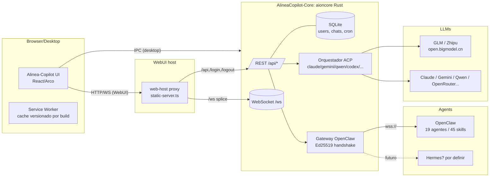
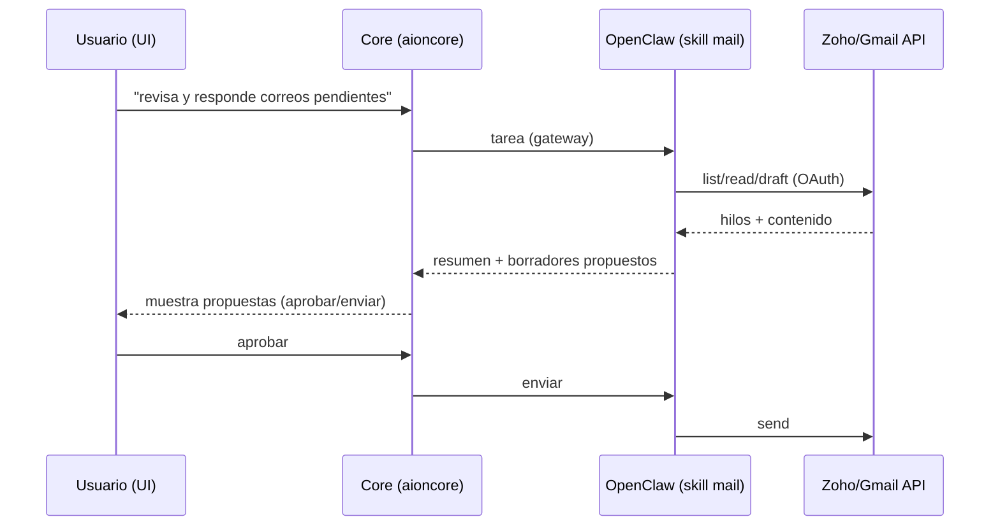
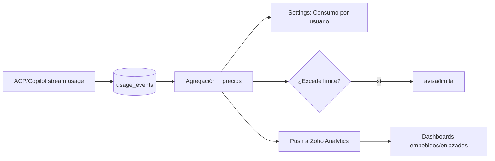
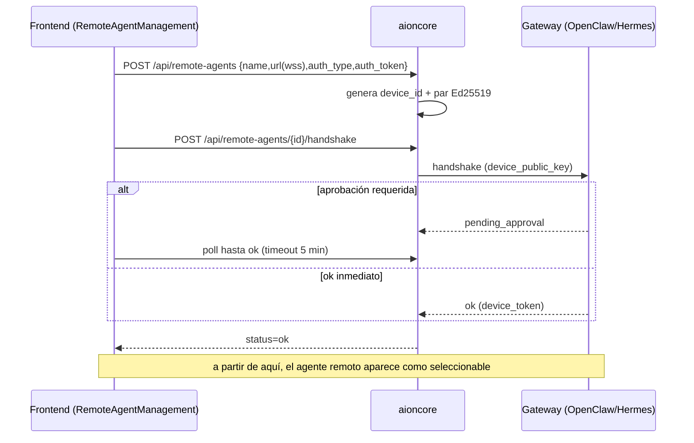

# Alinea Copiloto — Roadmap y conceptualización técnica

> Documento de trabajo para revisar con Claude Code (y con el equipo de Core/OpenClaw).
> Resume **lo pedido recientemente**, **lo ya hecho**, y **cómo encaja todo** a través de los
> 3 repos, con la comunicación end-to-end y las **dudas abiertas** por feature.
>
> Estado: borrador para discusión. No implementa nada nuevo; solo conceptualiza.
> Última actualización: rama `cursor/roadmap-planning-doc-69c4`.

---

## 0. TL;DR

Features pedidas (últimas conversaciones), agrupadas por "qué tan listo está el terreno":

| Feature | ¿Terreno listo en el código? | Dónde vive principalmente | Complejidad |
| --- | --- | --- | --- |
| **GLM AI (Zhipu) como modelo** | ✅ Casi listo — Zhipu ya es preset OpenAI-compatible | Frontend (provider) | Baja |
| **GLM "agente de documentos"** | ⚠️ Depende de qué sea (modelo vs. agente remoto) | Frontend + Core/OpenClaw | Media |
| **Hermes como agente** | ⚠️ Solo existe el logo; falta wiring | Frontend + Core (+ gateway) | Media |
| **Agentic Mail (correo)** | ⚠️ No existe; encaja como skill/MCP de OpenClaw | OpenClaw + Core (+ UI) | Media-Alta |
| **Todos** | ⚠️ Existe cron/scheduled, no "todos" | Frontend + Core | Media |
| **Visor DWG/DXF** | ⚠️ Hay punto de extensión de preview; falta el viewer | Frontend (+ Core para DWG) | Media-Alta |
| **Medición de consumos / límites** | ⚠️ Solo tokens por chat; falta agregación $ | Core + Frontend (+ Zoho) | Alta |

Leyenda: ✅ listo · ⚠️ falta trabajo · ⛔ bloqueado.

---

## 1. Los 3 repos y sus roles

| Repo | Rol | Lenguaje | Notas |
| --- | --- | --- | --- |
| **Alinea-Copilot** (este) | Frontend desktop + WebUI | TS/React/Arco + Electron | Empaqueta el binario `aioncore`. UI, IPC bridge, providers, preview, settings. |
| **AlineaCopilot-Core** | Backend `aioncore` | Rust | Auth multiusuario, SQLite, `/api/*`, orquestación de agentes ACP, gateway OpenClaw, preview de office, providers. |
| **Alinea-OpenClaw** | Agentes OpenClaw | (workspace de agentes/skills) | Fuente de verdad: `openclaw-agent/workspace/` (19 agentes, 45 skills, KB3). Se hornea con `Dockerfile.openclaw`. Se conecta como **agente remoto (gateway)**. |

> Nota de sincronización: el `top-level openclaw/` ya fue eliminado (commit `df42cf8` en Alinea-OpenClaw); la fuente única es `openclaw-agent/workspace/`. **No tocar `openclaw-agent/`** salvo que se pida.

---

## 2. Arquitectura actual (cómo se comunica todo hoy)

Puntos clave del flujo actual:

- **Frontend ↔ Core**: en desktop por IPC; en WebUI por HTTP/WS vía `packages/web-host/src/static-server.ts` (proxy de `/api/*`, `/login`, `/logout`; `/ws` por TCP splice).
- **Motor "Copilot"** (antes "Aion CLI", `aionrs`): es el chat normal que corre el **modelo** del provider seleccionado (Claude/Qwen/Gemini/GLM…).
- **OpenClaw**: se conecta como **agente remoto** vía gateway WebSocket con handshake Ed25519 (`RemoteAgentConfig`). En la UI hoy es **presentación** (`OpenClawAgentSpace.tsx`); el registro real del gateway lo hace el Core/deploy.
- **Consumo**: hoy solo se mide **tokens/contexto por conversación** (`TokenUsageData.total_tokens`), no costo en $.

---

## 3. Lo ya hecho / en PR (frontend)

| PR | Tema | Estado |
| --- | --- | --- |
| #1 | Rebrand inicial a Alinea (paleta Sage Green + Poppins) | merged |
| #2 | Notas de entorno Cursor Cloud (AGENTS.md) | merged |
| #5 | Consolidación frontend a main (rebrand + panel admin + login + multiuser/CSRF) | merged |
| #6 | Curación de asistentes (ocultar entretenimiento por defecto + toggle admin) | merged |
| #8 | De-branding (Tarea 5) + OpenClaw agent space (Tarea 4) | merged |
| #9 | "Copilot" en pill del home + placeholders + fix scroll | merged |
| **#10** | "Aion CLI" → "Copilot" en tarjetas de Settings → Agents + i18n | **abierta (draft)** |
| **#11** | Service Worker auto-update (cache versionado por build) | **abierta (draft)** |

Pendientes ya identificados (de turnos previos):

- **Core PR #2** `DELETE /api/admin/users/{id}` → **CONFLICTING** (repo Rust). Sin esto el botón "eliminar usuario" del panel admin no funciona end-to-end. Requiere: permiso de escritura en Core + OK explícito para merge.
- **Iconos SO** (`.icns`/`.ico` + PWA + tray) desde el PNG Alinea de alta resolución (falta el asset).

---

## 4. Features pedidas — deep dive (por repo, comunicación, estado, dudas)

### 4.1 GLM AI (Zhipu) como modelo + "agente de documentos"

**Qué pediste:** usar GLM (tiene un agente especializado para documentos), te gusta más que el CLI.

**Estado del código:**
- ✅ **El modelo GLM ya es soportable hoy.** `Zhipu` ya está como preset en `modelPlatforms.ts` (`platform: 'custom'`, `base_url: https://open.bigmodel.cn/api/paas/v4`, OpenAI-compatible). Basta crear el provider con la API key y elegir el modelo (p. ej. `glm-4`, `glm-4v`, `glm-4-long`).
- ⚠️ El **"agente de documentos" de GLM** es ambiguo: hay 2 interpretaciones.

**Dos caminos (hay que decidir):**

1. **GLM como modelo detrás de un Asistente "Documentos" (lo más simple).**
   - Se crea un *preset assistant* (catálogo de asistentes) cuyo `preset_agent_type` apunta a GLM, con prompt/skills orientados a documentos (DOCX/XLSX/PDF, BOM, memorias técnicas).
   - Comunicación: `UI → /api/providers (GLM) → ACP → open.bigmodel.cn`.
   - Encaje: **Frontend** (provider + assistant). Core ya rutea OpenAI-compatible.

2. **GLM Assistant/Agent API como agente remoto** (si te refieres al producto "agente" de Zhipu, con sus tools propias de documentos).
   - Se modela como provider especial o como **agente remoto** (similar a gateway), según protocolo de GLM.
   - Encaje: **Core** (adaptador del protocolo GLM Agent) + Frontend (selector).

**Dudas:**
- ¿"Agente de documentos" = un *prompt/assistant* corriendo sobre el modelo GLM, o el **producto Agent de Zhipu** con APIs propias?
- ¿Qué modelos GLM exactos quieres por defecto (`glm-4`, `glm-4-long`, `glm-4v` visión)?
- ¿GLM reemplaza a Claude como default para documentos, o convive?

---

### 4.2 Hermes como agente

**Qué pediste:** agregar Hermes (antes habíamos dicho "no construir Hermes").

**Estado del código:**
- Solo existe el **logo** (`agentLogo.ts → hermes: 'brand/hermes.svg'`). **No hay** `agent_type: 'hermes'` ni wiring. El union de tipos es `'acp' | 'remote' | 'aionrs' | 'openclaw-gateway' | 'nanobot'`.

**Cómo encajaría (2 opciones según qué sea Hermes):**

1. **Hermes como agente remoto (gateway), igual que OpenClaw.**
   - Reusar `RemoteAgentConfig` (protocol `openclaw`/`zeroclaw`/`acp`, `url: wss://...`, `auth_type`, handshake).
   - Necesita: **montar la UI de remote agents** (hoy `RemoteAgentManagement.tsx` existe pero está **huérfana** — `AgentModalContent` solo muestra "Local Agents" y redirige `?tab=remote → local`).
   - Encaje: Frontend (montar UI) + Core (registrar gateway Hermes) + repo/infra de Hermes (el servicio).

2. **Hermes como CLI local (ACP).**
   - El Core detecta el binario `hermes` y lo expone como `agent_type: 'acp'` con `backend: 'hermes'` (el logo ya aplicaría vía `getAgentLogo('hermes')`).
   - Encaje: Core (detección) + Frontend (ya lo listaría en Local Agents).

**Dudas:**
- ¿Qué **es** Hermes exactamente? ¿Un gateway remoto (como OpenClaw), un CLI local, o un servicio hosteado?
- ¿Cómo se presenta en la UI? ¿Otro "agent space" como OpenClaw, o un agente más en el selector?
- ¿Comparte las 6 categorías de OpenClaw o tiene las suyas?

---

### 4.3 Agentic Mail (correo)

**Qué pediste:** correo "agéntico" (la categoría "Admin" de OpenClaw ya menciona correo).

**Estado del código:** no existe nada de correo en el frontend. Encaja de forma natural como **skill/MCP de OpenClaw** (no como UI nueva pesada).

**Cómo encajaría:**
- **Capa de ejecución:** un *skill* en `openclaw-agent/workspace/skills/` (p. ej. `mail`) o un **MCP server** de correo conectado por el sistema MCP existente del Core.
- **Proveedor de correo:** Zoho Mail / Gmail vía su API (OAuth) o IMAP/SMTP. Mejor API (Zoho Mail/Gmail) que IMAP por seguridad.
- **Disparadores:** on-demand (chat) y/o **cron** (`ICronJob`) para revisar/triage automático.
- **UI:** mínima. Reusar el chat + quick-start "Admin → correo" que ya existe. Opcional: vista de "bandeja agéntica" más adelante.

**Dudas:**
- ¿Proveedor de correo objetivo? (Zoho Mail encaja con "y demás Zoho"; o Gmail/Outlook).
- ¿Nivel de autonomía? ¿Solo redacta borradores (human-in-the-loop) o envía solo?
- ¿OAuth por usuario (multiusuario) — dónde se guardan los tokens (Core SQLite cifrado)?
- ¿Es skill de OpenClaw o MCP independiente reusable por cualquier agente?

---

### 4.4 Todos

**Qué pediste:** "todos" (lista de tareas).

**Estado del código:** existe **cron/scheduled tasks** (`ICronJob`, `/scheduled`) — tareas con horario que disparan prompts. **No** existe una lista de "todos" general.

**Dos interpretaciones (hay que decidir):**

1. **Todos del agente (estilo plan de tareas).** El agente mantiene una lista de pasos durante una tarea larga y la muestra en el chat (como hace este propio asistente). Encaje: protocolo agente↔UI (eventos), render en mensajes.
2. **Todos del usuario (lista persistente).** CRUD de tareas por usuario, posiblemente sincronizada con **Zoho Projects** (la categoría Admin de OpenClaw menciona Projects). Encaje: Core (tabla `todos` + `/api/todos`) + UI (panel) + opcional sync Zoho.

**Recomendación inicial:** empezar por **(1) todos del agente** (barato, alto valor en tareas OpenClaw) y dejar **(2)** atado a la integración Zoho Projects.

**Dudas:**
- ¿Te refieres a la lista que el agente va tachando mientras trabaja, o a un gestor de tareas del usuario?
- Si es gestor de usuario: ¿se sincroniza con **Zoho Projects** o es local?

---

### 4.5 Visor DWG / DXF (CAD) en el chat

**Qué pediste:** visor de DWG/DXF (Ingeniería: HVAC/eléctrico/DC; va con BOM/memorias).

**Estado del código:** hay un **punto de extensión de preview claro**:
- `PreviewContentType` (union) en `common/types/office/preview.ts`.
- Mapeo extensión→tipo en `Preview/fileUtils.ts`.
- Switch de viewers en `Preview/components/PreviewPanel/PreviewPanel.tsx` + `components/viewers/*`.
- Office (DOCX/XLSX/PPT) ya funciona vía `OfficeWatchViewer` + APIs `/api/word-preview/start`, `/api/excel-preview/start` (esto cubre parte del item "officecli XLSX/DOCX").

**Cómo encajaría (agregar un viewer CAD):**
1. Añadir `'cad'` a `PreviewContentType`.
2. Mapear `dwg`, `dxf` en `FILE_EXTENSION_MAP`.
3. Crear `CadViewer.tsx` en `viewers/` y ramificar en `PreviewPanel.tsx`.

**Reto técnico — DWG vs DXF:**
- **DXF** (texto/ASCII): renderizable en cliente con `dxf-parser` + Three.js/canvas. Viable 100% frontend.
- **DWG** (binario propietario de Autodesk): **no** hay parser JS libre confiable. Opciones:
  - **Conversión en backend** (Core): DWG→DXF/SVG/PDF con herramientas tipo ODA File Converter / LibreDWG / Teigha, y previsualizar el resultado (patrón igual a officecli).
  - O pedir DXF al usuario.

**Recomendación:** **DXF primero** (frontend puro), y **DWG vía conversión en Core** después.

**Dudas:**
- ¿Prioridad DWG o DXF? ¿Volumen real de DWG?
- ¿Aceptable convertir DWG en el Core (licencia de la herramienta de conversión)?
- ¿Solo visualizar, o también medir/seleccionar capas/exportar?

---

### 4.6 Medición de consumos / límites por usuario (+ dashboards Zoho)

**Qué pediste:** medir los consumos (lo de límites por usuario y monitoreo Zoho).

**Estado del código:**
- Frontend mide **tokens/contexto por conversación** (`TokenUsageData.total_tokens`, `ContextUsageIndicator`, streams `acp_context_usage` / `stream_end usage`).
- Detección de errores de cuota/billing del provider (`errorDetection.ts`, `check_provider_billing`).
- **No** hay agregación de **costo en $**, ni límites, ni dashboard.

**Diseño propuesto (atado al panel admin que ya existe):**

- **Core (Rust):**
  - Tabla `usage_events` (user_id, ts, model, provider, prompt_tokens, completion_tokens, cost estimado).
  - Tabla de **precios por modelo** (config) para estimar `cost`.
  - Tabla `user_limits` (límite mensual $/tokens, hard/soft).
  - Endpoints: `GET /api/admin/usage` (agregado, filtros por usuario/fecha), `GET /api/me/usage` (vista del propio usuario), `GET/PUT /api/admin/users/{id}/limits`, y *enforcement* (rechazar/avisar al exceder).
- **Frontend:**
  - Sección **Settings → Users → Consumo** (admin): tabla + gráfico por usuario/modelo/fecha; editar límites.
  - Vista usuario: "mi consumo" (reusar el ring + totales).
- **Zoho (monitoreo):**
  - OpenClaw (skill Zoho Analytics) o un job que **empuje** métricas agregadas a **Zoho Analytics**, y la UI embeba/enlace los dashboards.

**Dudas:**
- ¿Costo **estimado** (tabla de precios local) o **real** (si el provider expone billing)?
- ¿Límite por **$** o por **tokens**? ¿hard (bloquea) o soft (avisa)?
- ¿Período (mensual/diario)? ¿reset automático?
- ¿Dashboards **dentro** de la app (embed) o solo enlace a Zoho Analytics?
- ¿El push a Zoho lo hace OpenClaw (skill) o el Core directo?

---

## 5. Modelo de comunicación de agentes remotos (OpenClaw / Hermes)

Reutilizable para Hermes (mismo mecanismo que OpenClaw):

> ⚠️ **Bloqueante de UI para Hermes/OpenClaw "gestionables"**: `RemoteAgentManagement.tsx` está implementado pero **no montado**. Para administrar gateways desde la app hay que montarlo (hoy `?tab=remote` redirige a `local`).

---

## 6. Dudas abiertas (consolidado para revisar con Claude Code)

1. **GLM:** ¿agente = assistant sobre modelo GLM, o producto Agent de Zhipu? ¿modelos default?
2. **Hermes:** ¿qué es (gateway remoto / CLI / hosteado)? ¿UI propia o un agente más?
3. **Agentic Mail:** ¿Zoho Mail/Gmail? ¿autonomía (borrador vs envío)? ¿OAuth por usuario? ¿skill OpenClaw o MCP?
4. **Todos:** ¿todos del agente o gestor de usuario? ¿sync Zoho Projects?
5. **DWG/DXF:** ¿DWG (conversión en Core) o DXF (cliente) primero? ¿licencia de conversor DWG?
6. **Consumos:** ¿$ vs tokens? ¿hard/soft? ¿dashboards embebidos vs enlace Zoho? ¿quién empuja a Zoho?
7. **Remote Agents UI:** ¿montamos `RemoteAgentManagement` (necesario para Hermes/OpenClaw administrables)?
8. **Core PR #2 (DELETE user):** ¿me das permiso de escritura + OK de merge para resolver el conflicto?

---

## 7. Roadmap sugerido por fases (orden por dependencias, sin estimaciones de tiempo)

**Fase A — Cierre de lo en vuelo (frontend, bajo riesgo):**
- Merge PR #10 (Copilot en Settings) y #11 (SW auto-update).
- Iconos SO desde PNG Alinea (falta asset).
- Core PR #2 (DELETE user) — requiere permisos/merge.

**Fase B — Modelos y agentes (habilita el resto):**
- GLM (Zhipu) provider + assistant "Documentos" (Frontend, bajo riesgo).
- Montar `RemoteAgentManagement` (desbloquea Hermes/OpenClaw administrables).
- Hermes wiring (según definición) + presentación.

**Fase C — Productividad agéntica:**
- Agentic Mail (skill OpenClaw/MCP + OAuth) — depende de proveedor.
- Todos del agente (UI de plan de tareas) → luego sync Zoho Projects.

**Fase D — Documentos y CAD:**
- officecli: confirmar/pulir preview+descarga XLSX/DOCX (infra ya existe).
- Visor DXF (cliente) → Visor DWG (conversión en Core).

**Fase E — Gobernanza/consumos:**
- Medición de consumos (Core: usage_events + precios + límites; Frontend: panel).
- Dashboards Zoho (push + embed/enlace).

---

## 8. Apéndice — archivos clave por subsistema (Alinea-Copilot)

| Subsistema | Archivos |
| --- | --- |
| Agentes remotos / gateway | `common/types/agent/remoteAgentTypes.ts`, `common/types/agent/detectedAgent.ts`, `common/adapter/ipcBridge.ts` (`remoteAgent`, `openclawConversation`), `pages/settings/AgentSettings/RemoteAgentManagement.tsx` (huérfano) |
| Providers / GLM | `common/config/storage.ts` (`IProvider`), `utils/model/modelPlatforms.ts` (`MODEL_PLATFORMS`, Zhipu), `common/utils/platformAuthType.ts`, `pages/settings/components/AddPlatformModal.tsx` |
| Preview / viewers | `common/types/office/preview.ts` (`PreviewContentType`), `pages/conversation/Preview/fileUtils.ts`, `pages/conversation/Preview/components/PreviewPanel/PreviewPanel.tsx`, `Preview/components/viewers/*`, `OfficeWatchViewer.tsx` |
| Office preview APIs | `ipcBridge.ts` (`wordPreview`, `excelPreview`, `pptPreview`) + Core `/api/*-preview/start` |
| Hermes | `utils/model/agentLogo.ts` (solo logo) |
| Cron / scheduled | `ipcBridge.ts` (`cron`, `ICronJob`), `pages/cron/ScheduledTasksPage/*` |
| Consumo (tokens) | `common/config/storage.ts` (`TokenUsageData`), `ContextUsageIndicator.tsx`, `useAcpMessage.ts`, `useAionrsMessage.ts` |
| OpenClaw agent space (UI) | `pages/guid/components/OpenClawAgentSpace.tsx` |
| Engine "Copilot" (rebrand) | `utils/model/agentLogo.ts` (`displayEngineName`), `pages/guid/hooks/useGuidAgentSelection.ts` |
| WebUI proxy | `packages/web-host/src/static-server.ts`, `backend-launcher.ts` |
| Service Worker | `public/sw.js`, `packages/desktop/electron.vite.config.ts` (`swVersionStampPlugin`), `services/registerPwa.ts` |

---

> **Cómo usar este doc:** revísalo con Claude Code respondiendo las **8 dudas** de la sección 6.
> Con esas respuestas puedo aterrizar PRDs/issues por feature y empezar por la Fase que priorices.
