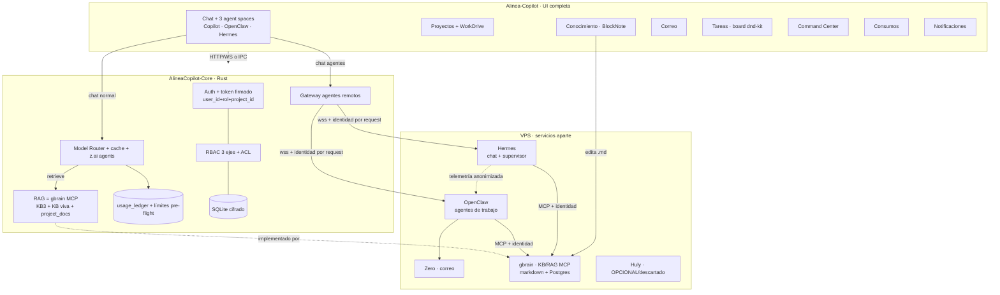
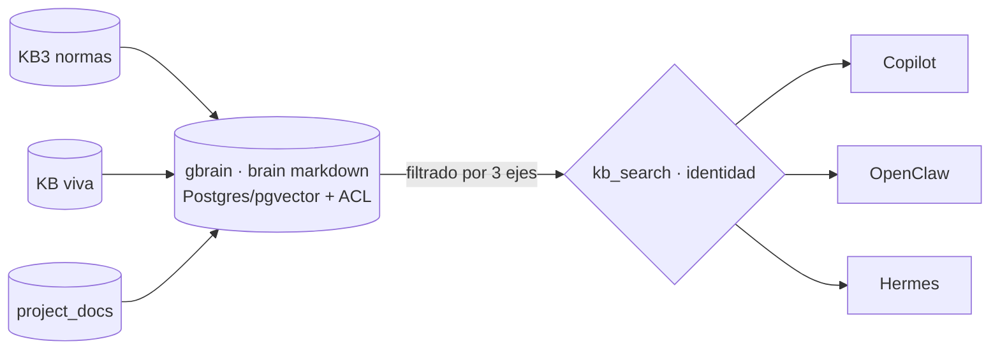

# Alinea Copiloto — Fase 2 · Blueprint completo (v2)

> Plan **self-contained y al 100%** para construir la Fase 2 sobre el stack vivo (3 repos + VPS).
> Reescrito para que quede claro de punta a punta. NO es greenfield: se construye sobre lo existente.
> Acompaña a `Alinea_FASE2_Guias.md` (el "cómo construir + cómo probar", paso a paso).
>
> Piezas que más se aclararon: **chat con Hermes** (estaba subutilizado), **RAG compuesto único**
> (lo ven Copilot/OpenClaw/Hermes), una **UI completa** que guía al usuario, y la **capa humana
> nativa y liviana** dentro de Alinea (**BlockNote** para conocimiento + **board dnd-kit** para tareas),
> dejando **Huly como opcional/descartado por defecto** (sin el servicio pesado de ~16 GB).

---

## 0. Mapa mental en 6 frases

1. **3 motores de IA** conviven: **Copilot** (chat con modelos, en el Core), **OpenClaw** (agentes de trabajo MEP, en el VPS) y **Hermes** (en el VPS) — y a **Hermes también se le chatea**, no solo trabaja de fondo.
2. **Una sola identidad firmada** (`user_id`+rol+proyecto) viaja en **cada** request y **filtra todo**.
3. **Un solo RAG/KB compuesto** implementado con **gbrain** (markdown + Postgres + MCP, hecho para OpenClaw/Hermes) que **los 3 motores consultan** con esa identidad.
4. **Una sola medición de consumo** ($) que cubre los 3 motores.
5. **Proyectos** (estilo Claude) + **carpetas Zoho WorkDrive** como contenedor de trabajo.
6. **Una UI completa** (no solo chat): proyectos, conocimiento, correo, tareas, consumos, command center.

---

## 1. Decisiones congeladas (no re-litigar)

| Tema | Decisión |
|---|---|
| Stack | **Fijo**: Core **Rust (aioncore)**, Frontend **Electron/React/Arco**, agentes **OpenClaw** y **Hermes** + **Zero** (correo) como servicios en el VPS; **Huly opcional**. Capa humana **nativa** (BlockNote + dnd-kit). NO Next.js/Supabase/Clerk. |
| Identidad | El Core emite por request un **token de contexto firmado** Ed25519 `{user_id, rol[], project_id?, scopes, exp, jti}`. El gateway lo propaga a OpenClaw/Hermes en **cada** mensaje. |
| Segregación | **3 ejes combinados (AND)**: rol/etiqueta **+** ownership/membership **+** project-scope. (Ver §5 — corrige el "solo rol" del plan anterior.) |
| RAG / KB | **Compuesto y único**, implementado con **gbrain** (MIT, markdown + Postgres/pgvector + **MCP**; hecho para OpenClaw/Hermes). Fuentes: KB3 + KB viva + project_docs. Consultado por **Copilot, OpenClaw y Hermes** con **ACL por request**. (Ver §6 y §6.5/§6.6.) |
| Consumos | **Llaves de Alinea vía el Core** → **un ledger** mide los 3 motores; límite **pre-flight** (antes de gastar). |
| Hermes | **Doble rol**: (a) **agente de chat** seleccionable por el usuario; (b) **supervisor** que propone fixes de skills (admin aprueba). (Ver §8.) |
| Mail | **Solo borradores** (human-in-the-loop). Integrar **Zero (mail-0/zero)** vía MCP; fallback IMAP por usuario. |
| Knowledge/Tareas/Notif. (humano) | **Nativo y liviano DENTRO de Alinea**: Conocimiento con **BlockNote** (editor Notion-like, React, MPL-2.0), Tareas con **board dnd-kit** (MIT), Notificaciones nativas (WS del Core). El **RAG del Core** indexa esos docs. **Huly = opcional/descartado por defecto** (ver §11). |
| Router de modelos | **Auto** (el más barato que cumpla calidad) + **override** del usuario (`económico ⇄ máxima`). |
| Secretos | Cifrado **por usuario** con **envelope encryption** (DEK por usuario ⊂ master KEK), para poder rotar. |
| Visor DXF | Frontend: **parser + renderer** (`dxf-parser` + `three-dxf`/canvas), capas + medición (distancia/área/cotas) con unidades del header. |

---

## 2. Los 3 repos + servicios del VPS

| Pieza | Rol | Dónde |
|---|---|---|
| **AlineaCopilot-Core** (Rust) | Cerebro: auth/identidad, RBAC, **RAG compuesto**, router de modelos, ledger, gateway de agentes, SQLite. | Repo Core |
| **Alinea-Copilot** (React/Electron) | **Toda la UI** (chat, proyectos, conocimiento, mail, tareas, command center, consumos, DXF). | Repo Frontend (este) |
| **Alinea-OpenClaw** (skills/MCP) | 19 agentes, 45 skills, KB3, MCPs (dxf-takeoff, docgen, hvac, **zoho workdrive**, **zero-mail**). | Repo OpenClaw |
| **OpenClaw** (servicio) | Ejecuta los agentes de trabajo. Se conecta como agente remoto (gateway wss+Ed25519). | VPS |
| **Hermes** (servicio) | **Chat** (orquestador/ops copilot) **+ supervisor** que mejora skills. Mismo gateway. | VPS |
| **Zero** (servicio) | Correo agéntico (unified inbox + MCP). | VPS |
| **gbrain** (servicio) | **KB/RAG** (markdown + Postgres/pgvector) expuesto por **MCP**; la "capa de conocimiento" para OpenClaw/Hermes/Copilot. MIT. | VPS |
| **Huly** (servicio) | **Opcional — descartado por defecto.** PM pesado tipo Jira+Notion; reemplazado por módulos nativos (BlockNote + dnd-kit). Sumar solo si se necesita PM avanzado y hay hierro. | VPS/box aparte |

> Nota: este repo (Alinea-Copilot) **no** contiene `openclaw/` ni Hermes; viven en el VPS. Los docs de Fase 2 se versionan aquí y deben **espejarse** a `Alinea-OpenClaw/fase2/`.

---

## 3. Arquitectura objetivo (completa)

**Invariante de oro:** la identidad (`user_id`+rol+proyecto) viaja en **cada** request y **filtra todo** (RAG, archivos, mail, memoria, skills). El agente nunca "asume" el usuario: lo **recibe firmado** del Core.

---

## 4. Los 3 motores — qué son y en qué se diferencian

| Motor | Qué es | Cuándo se usa | Cómo se chatea |
|---|---|---|---|
| **Copilot** (`aionrs`) | Chat con **modelos** (GLM/Claude/Qwen/MiniMax) vía el Core. | Chat general, generación de documentos diseñados (z.ai agents), preguntas. | Selector de modelo en el home (default Claude Sonnet / GLM). |
| **OpenClaw** | Agentes de **trabajo MEP** (6 categorías, 45 skills, MCPs). | Tareas reales: BOM, memoria de cálculo, RFQ, takeoff DXF, correo, etc. | "Agent space" OpenClaw con las 6 categorías (ya existe). |
| **Hermes** | **Chat de orquestación/ops + supervisor** que mejora el sistema. | Hablar **sobre** el sistema (por qué falló un skill, mejorar un flujo, estado, “qué puede hacer X”), tareas meta/coordinación. **Y** de fondo, propone fixes. | **NUEVO**: "agent space" Hermes seleccionable → conversación directa. |

> **Aclaración clave (Hermes subutilizado):** Hermes no es solo un proceso de fondo. En la UI será un **agente con el que se chatea** (su propio espacio/selector, avatar `hermes.svg`), **además** de su rol supervisor. Persona sugerida: "**Copilot de operaciones/mejora**" — el usuario le pregunta por el estado, le pide mejorar flujos/skills, coordina entre agentes. (La persona exacta la defines tú; el wiring es el mismo gateway que OpenClaw.)

---

## 5. CIMIENTO — Identidad + Segregación (construir PRIMERO)

Sin esto, RAG/mail/proyectos/consumos **no** son seguros. Bloquea todo lo demás.

### 5.1 Identidad por request (con ciclo de vida)
- El Core emite, **por cada request a un agente**, un token firmado Ed25519 `{user_id, rol[], project_id?, scopes, exp, jti}` (clave privada en Core; pública en OpenClaw/Hermes).
- El **gateway** lo incluye en **cada** mensaje wss (no solo en connect). El agente **valida la firma** y opera **solo dentro del scope**. Sin token válido → rechaza + audita.
- **Revocación:** `exp` corto (5–15 min) + **denylist de `jti`** o `cred_version` por usuario. Al desactivar/cambiar rol → tokens previos inválidos.
- **Refresh para tareas largas:** una corrida de agente que dura más que `exp` se **renueva** contra el Core mientras el usuario siga vigente; si pierde permiso → la tarea se aborta + audita.

### 5.2 Segregación de **3 ejes** (corrige el "solo rol")
El acceso a un recurso requiere **las tres** condiciones (AND):
1. **Rol/etiqueta:** `acl_policy(etiqueta → roles)`. Docs/skills etiquetados `público | interno | confidencial-<área>`.
2. **Ownership/membership:** `resource_acl(resource_id, principal{user|role|group}, perm)`. Cada proyecto/doc/buzón tiene **dueño + miembros**.
3. **Project-scope:** el `project_id` del token acota aún más (dentro del Proyecto X no se tocan recursos del Proyecto Y).

> Esto resuelve la fuga **horizontal**: dos `tecnica` (mismo rol) **no** se ven entre sí salvo membership explícita. El plan anterior solo cubría lo vertical (gerencia↔técnico).

### 5.3 Aislamiento por capa (por identidad, NO por proceso)
| Capa | Aislamiento |
|---|---|
| Chats | por `user_id` (ya) |
| Archivos/workspace | root por usuario (`/api/fs/*`); el agente solo ve su scope |
| **RAG/KB** | recuperación filtrada por los 3 ejes (§6) |
| Memoria de agente | **namespaced por `user_id`** (sin store global mezclado) |
| Skills | disponibilidad por rol |
| Secretos | envelope encryption por usuario (DEK⊂KEK) |
| Salida del modelo | **guardrail de salida** (§5.4) |
| Auditoría | `audit_log` de accesos (esp. confidencial) |

### 5.4 Guardrail de **salida** (no solo de entrada)
El ACL filtra lo que el agente **recupera**, pero podría **filtrar** datos en su respuesta. Medida: pasar al modelo **solo** lo permitido para ese request (minimización) + verificación de la respuesta contra la etiqueta/rol del destinatario. Mitiga prompt-injection y contexto cruzado.

### 5.5 Hermes y datos
Como **supervisor**, Hermes ve **telemetría anonimizada/agregada** (errores, ratings), **nunca** contenido confidencial. Como **chat**, Hermes recibe la misma identidad firmada y se scopea igual que cualquier agente.

---

## 6. RAG COMPUESTO — la pieza que no estaba clara

**Idea central:** **un solo** índice de conocimiento en el **Core**, alimentado por **varias fuentes**, consultado por **los 3 motores** con **una sola** política de acceso. No son 3 RAGs separados: es **uno compuesto**.

### 6.1 Fuentes (lo que compone el RAG)
| Fuente | Qué es | Mutabilidad |
|---|---|---|
| **KB3** | Normas/estándares Ingelmec (horneada en OpenClaw). | Inmutable (re-import al re-hornear). |
| **KB viva** | Docs editables desde la UI (`/knowledge`, BlockNote). | Mutable. |
| **project_docs** | Documentos adjuntos a un Proyecto (§10). | Mutable, scoped a proyecto. |
| **memoria/insights** (opcional) | Insights de contactos (mail), notas. | Mutable, scoped a usuario. |

### 6.2 Un índice, tres consumidores
- **Índice único** implementado con **gbrain** (ver §6.5): brain markdown sincronizado a **Postgres/pgvector** (o PGLite), con metadatos por página (`etiqueta`, `owner`, `project_id`, `source`, `version`) y **hybrid search** (vector + BM25 + reranker).
- **Consumidores:**
  - **Copilot** (in-Core) → consulta gbrain (su MCP/HTTP) con la identidad del request.
  - **OpenClaw** y **Hermes** (remotos) → consultan el **MCP de gbrain**, **llevando la identidad firmada**.
- **ACL por request:** toda búsqueda filtra por los **3 ejes** (§5.2) según el `{user_id, rol, project_id}` del solicitante. Lo que no pasa el filtro **no se recupera** (y no se cuenta como existente).

### 6.3 Frescura / invalidación
- Cada entrada lleva `version` (hash de contenido). Al editar un doc → re-embedding de esa entrada (cambia su `version`).
- El **prompt cache** (§7) usa la `version` en su clave → no sirve contexto viejo.
- El re-indexado **consume** → al ledger en bucket `system:kb-index`.

### 6.4 Citas y trazabilidad
Toda respuesta basada en RAG incluye **fuente** (doc + sección). Si un rol no tiene acceso, la fuente **no aparece** (ni siquiera como "existe pero no puedes verla", salvo que se decida lo contrario).

### 6.5 Implementación del RAG: **gbrain** (markdown + Postgres + MCP)

**Decisión (17-jun):** el KB/RAG se implementa con **gbrain** (`github.com/garrytan/gbrain`, **MIT**) en vez de un índice a medida. **Por qué encaja perfecto:** está hecho **por Garry Tan justamente como capa de conocimiento/memoria para OpenClaw y Hermes**; es **markdown-first** (un git repo de `.md` es el sistema de registro), se sincroniza a **Postgres/pgvector** (o **PGLite** local) y expone **un servidor MCP** (30+ tools; hybrid search vector+BM25+reranker, modos `conservative/balanced/tokenmax`). "Para que cualquiera acceda" → `gbrain serve --http` (MCP HTTP con **OAuth 2.1**, scopes `read/write/admin`, dashboard `/admin`) + Postgres compartido; soporta **team mounts** y **public subsets**.

**Cómo encaja en el RAG compuesto (§6):**
- gbrain **es** el índice único: las fuentes (KB3, notas/KB viva, project_docs) viven como **sources markdown** dentro de los **brain(s)** de gbrain.
- Los **3 motores consultan gbrain por MCP**: OpenClaw/Hermes vía el MCP HTTP; Copilot vía el Core (que llama el MCP/HTTP de gbrain). **Reemplaza** el `sqlite-vec` a medida.
- **ACL/segregación (§5.2):** mapear los **3 ejes** a la **topología de gbrain** — brain/source **compartido** para KB3 (público/equipo), brains o sources **privados** para confidencial (por rol/usuario), y **scopes/OAuth** del MCP por usuario. ⚠️ gbrain comparte a granularidad **brain/source/scope**; el ACL fino por documento/rol se modela eligiendo bien brains/sources (público vs `confidencial-<área>`).

### 6.6 🔧 Instrucción para Claude (instalar/configurar gbrain) + parte frontend

**Backend / VPS (Claude):**
1. Instalar gbrain por su **ruta oficial** (está diseñado para ser "instalado/operado por un agente"; ver `docs/INSTALL.md`). Compartido → **Postgres + pgvector** (self-host o Supabase); single → `gbrain init --pglite`. ⚠️ **NO** usar el paquete npm squatteado `npm i -g gbrain`.
2. **Embeddings:** configurar API key (OpenAI/ZeroEntropy por defecto) — costo ~$0.10/M tokens de ingestión → al ledger `system:kb-index`.
3. **Importar** KB3 + notas (`gbrain import ...`): KB3 como **source público/equipo**; confidenciales como **sources/brains separados** por rol.
4. **Exponer MCP:** `gbrain serve --http` en el VPS (OAuth 2.1 + scopes + `/admin`).
5. **Conectar OpenClaw y Hermes** a ese MCP (`gbrain connect https://host/mcp --token ...` o config MCP `{"command":"gbrain","args":["serve"]}`), llevando la **identidad/scope por usuario** (§5).
6. **Copilot:** el Core consulta el MCP/HTTP de gbrain con la identidad del request.
7. Definir la **topología de sharing + ACL** (brains/sources/mounts/public-subset/scopes) según roles (§5.2).

**Frontend (Cursor / yo):**
- Módulo `/knowledge` = **navegador tipo Obsidian** del brain: **árbol de carpetas/páginas** (los `.md`), **visor/editor markdown** (BlockNote o editor md), **búsqueda** (vía gbrain search/query), **backlinks/grafo** (opcional). Habla con gbrain (HTTP) y/o con los `.md` vía el Core, **respetando ACL**.

**Aceptación:** un agente (OpenClaw/Hermes/Copilot) responde **citando** una página del brain (gbrain); un rol sin acceso **no** la recupera; en `/knowledge` el usuario navega el **árbol** y abre/edita una página `.md` que queda **indexada (sync)** sin re-hornear.

---

## 7. Modelos — router + caching + documentos diseñados

### 7.1 Router (Core)
- Adaptadores: **z.ai/GLM** (chat + **Agents API** slides/docs), **MiniMax**, **Claude**, **OpenRouter/Qwen**.
- **Regla:** por subtarea, el **más barato que cumpla la calidad** (tabla declarativa por tipo de subtarea; evolucionar con evals offline).
- **Failover:** si un provider cae / rate-limit / responde basura → reintento en el siguiente de la cadena (se registra; afecta consumo).
- **Override del usuario:** toggle `económico ⇄ máxima calidad` por chat/proyecto.

### 7.2 Documentos "de diseñador"
- Los **Agents de z.ai** generan el artefacto **diseñado server-side** (slides/doc) → no se queman tokens de formato en el chat.
- **Plantillas Alinea** (Sage Green, Poppins) **por tipo de documento** ("lo que lleva cada uno": propuesta, memoria técnica, BOM, informe gerencial…). El agente rellena → consistencia visual.
- z.ai Agents suele ser **asíncrono** (job → poll → artefacto): el adaptador maneja job/poll/descarga/timeout/errores y manda el costo al ledger.

### 7.3 Prompt caching
- Ordenar prompt `[estable: system + skills + KB/proyecto] → [volátil: turno]`. Prefijo estable primero.
- Claude: `cache_control: ephemeral`. GLM/MiniMax/OpenAI: prefijo **idéntico** (cache automático). Flag de soporte por provider.
- **Cachear solo prefijos reutilizados** (el `cache-write` tiene premium; cachear lo que no se reusa cuesta más).
- Clave de cache incluye la **`version`** del contexto (§6.3). El **ledger** distingue **cache-read** vs **cache-write**.

---

## 8. Agentes — OpenClaw + Hermes (chat + supervisor)

### 8.1 Gateway (común)
`RemoteAgentConfig` (wss + Ed25519). Se **monta el Command Center** (§13) para administrarlos. El protocolo lleva **identidad por request** (§5.1).

### 8.2 OpenClaw
- Agente de trabajo: 6 categorías (Gerencia/Técnica/Ingeniería/Comercial/Admin/Financiera), 45 skills, MCPs.
- Recibe identidad firmada → opera scoped → consulta el **RAG compuesto** (§6) con esa identidad.

### 8.3 Hermes — **doble rol** (lo que faltaba)
**(a) Chat (nuevo, primer plano):**
- Hermes aparece como **agente seleccionable** en la UI (su propio espacio + avatar). El usuario **conversa** con él.
- Rol conversacional sugerido: **copilot de operaciones/mejora** — estado del sistema, "¿por qué falló este skill?", "mejora este flujo", coordinación entre agentes, ayuda meta. (Persona exacta la defines tú.)
- Mismo gateway + misma identidad firmada + mismo RAG (scoped).

**(b) Supervisor (de fondo):**
- Consume **telemetría anonimizada** → **propone** fixes de skills → **admin aprueba** en el Command Center → se aplican.
- **Persistencia (gap corregido):** el fix aprobado genera **commit/PR a `Alinea-OpenClaw`** (la fuente que hornea `deploy-v4.sh`), no solo un parche en runtime (que se perdería en el próximo rebuild). Rollback = revert del commit. Antes de aplicar, debe pasar **tests por skill** (canary).

### 8.4 🔧 Hermes/OpenClaw en el SELECTOR de arriba (Opción A — instrucción para Claude)

> **Decisión (16-jun):** Hermes y OpenClaw deben **seleccionarse en el pill bar de arriba** (`AgentPillBar`), como Copilot y los agentes custom — **no** como "espacios" que solo rellenan el prompt. Camino elegido: **Opción A — el backend los expone como agentes seleccionables**; el frontend los muestra solo.

**Hallazgo (frontend, ya verificado en el código):**
- `AgentPillBar.tsx` **ya** sabe renderizar agentes **remotos/custom** (avatar emoji o logo) y al hacer clic llama `onSelectAgent(getAgentKey(agent))` (selección real).
- El selector filtra con `isSupportedNewConversationAgent` en `utils/model/agentTypeSupportPolicy.ts`:
  - `SUPPORTED_NEW_CONVERSATION_AGENT_TYPES = { 'acp', 'aionrs' }`
  - `DEPRECATED_RUNTIME_AGENT_TYPES = { 'openclaw-gateway', 'remote', 'nanobot', 'gemini' }`
  - Por eso **OpenClaw (`openclaw-gateway`) y Hermes (`remote`/gateway) NO aparecen** hoy en el selector. El cerdito 🐷 sí aparece porque es un **custom tipo `acp`**.
- `availableAgents` viene de `/api/agents` (`DETECTED_AGENTS_SWR_KEY → fetchDetectedAgents`).

**Qué debe hacer el BACKEND (Claude / Core + gateway):**
1. **Exponer Hermes y OpenClaw en `/api/agents`** como **agentes seleccionables** con un `agent_type` que el selector acepte — **preferido: presentarlos como `acp`** (el gateway actúa como adaptador ACP), con `id`/`backend` propios, `name` ("Hermes" / "OpenClaw") y `avatar`/`icon`.
2. **Cablear el camino de envío** (crear conversación + enviar/stream) para esos agentes vía el gateway, **con la identidad firmada por request** (§5.1). Sin esto, seleccionarlos rompería el chat (esa es la razón por la que hoy están deprecados).
3. Mantener **handshake/registro** del gateway (`RemoteAgentConfig`) e **identidad por request**; scoping por usuario (§5/§6).

**Qué hace el FRONTEND (Cursor — mínimo):**
- Si el backend los expone como **`acp`** → **cero cambios**: aparecen solos en el pill bar.
- Si se exponen como `openclaw-gateway`/`remote` → agregar ese tipo a `SUPPORTED_NEW_CONVERSATION_AGENT_TYPES` **solo cuando el send path ya funcione** (si no, rompe).
- Cuando ya sean seleccionables arriba, **replegar/retirar el "espacio" de OpenClaw** (las tarjetas que rellenan prompt) para no duplicar la entrada.

**Aceptación (100%):**
- Hermes y OpenClaw aparecen como **pills seleccionables arriba** (junto a Copilot y el custom), con su avatar.
- Seleccionar **Hermes** + enviar → la conversación va a Hermes y **responde** (con el gateway registrado), **scoped por usuario** (un usuario no ve datos/sesiones de otro).
- Igual para OpenClaw.

> **Estado:** frontend **listo** (el pill bar ya soporta agentes remotos). **Pendiente backend (Claude):** exponerlos como `acp` + cablear el send path con identidad. Una vez hecho, salen en el selector sin más (o con el flip de 1 línea de la política si se eligió el tipo gateway).

---

## 9. Agentic Mail = Zero + OpenClaw

- **Deploy** Zero en el VPS (Postgres propio). Conectar cuentas por **OAuth** (Gmail/Outlook/Zoho) o **IMAP**; creds **cifradas por usuario** (§5.3).
- OpenClaw usa el **MCP de Zero** (o IMAP fallback) para: **triage/priorización**, **insights de contactos** (a RAG/CRM), **borradores profesionalizados** (humano aprueba/envía — **nunca** auto-envía).
- **Multi-tenant (gap):** el wrapper MCP debe operar **siempre** sobre la cuenta del `user_id` del token (mapear `Zero account ↔ user_id`). Un usuario **nunca** ve el buzón de otro.
- **Disparadores:** on-demand (chat) + cron (triage periódico, costo al dueño del job).
- **Recomendación de fase:** arrancar con **IMAP por usuario** (multi-tenant trivial) y subir a Zero cuando el hierro (§14) y el mapeo estén listos.

---

## 10. Proyectos + carpetas WorkDrive

- **Entidad `projects`** en el Core: `(id, owner, members[], rol_scope, name, desc, instrucciones/contexto, folder_ref{local|workdrive})`. Los **chats** pertenecen a un proyecto; los **docs** alimentan el **RAG del proyecto** (§6).
- **WorkDrive como conector:** la carpeta del proyecto mapea a Zoho WorkDrive vía el MCP **`zoho_workdrive_download/upload`** (ya existe). 
- **Conflicto MCP ↔ TrueSync (gap):** el usuario ya usa WorkDrive TrueSync local. Definir estrategia para evitar pisar versiones (carpeta del agente separada, o lock, o "última gana" con aviso).
- **Unificar el picker:** "Work in a project" (`GuidWorkspaceFootnote.tsx`) usa hoy el **diálogo nativo** (solo desktop). Unificar para usar `/api/fs/*` en WebUI.
- **Membership (§5.2):** un proyecto tiene dueño + miembros; un técnico no ve el proyecto de gerencia salvo membership.

---

## 11. Knowledge / Tareas / Notificaciones — NATIVO en Alinea (Huly opcional)

**Decisión (16-jun):** la capa humana se construye **nativa y liviana dentro de Alinea**, no con Huly. Esto elimina el servicio pesado (~16 GB), el problema de SSO/OIDC y la duda de licencia. Tres piezas:

### 11.1 Conocimiento → **navegador tipo Obsidian sobre gbrain**
- **Backend del KB = gbrain** (§6.5): brain markdown (git de `.md`) + Postgres + MCP. Es la fuente y el RAG.
- **Frontend `/knowledge` (yo):** UI **tipo Obsidian** — **árbol** de carpetas/páginas, **visor/editor markdown** (editor de bloques **BlockNote**, `github.com/TypeCellOS/BlockNote`, **MPL-2.0**; ⚠️ sin paquetes "XL"/GPL), **búsqueda** (gbrain search) y backlinks/grafo (opcional).
- Editar una página en `/knowledge` escribe el `.md` del brain → gbrain **sincroniza** al índice (con ACL) → los agentes lo ven (§6).

### 11.2 Tareas (board) → **dnd-kit**
- Repo: `github.com/clauderic/dnd-kit`. **MIT.** Estándar moderno de drag-and-drop en React.
- Montamos un **Kanban liviano** (dnd-kit + componentes Arco), no otra app de PM. Vive en `/tasks`. Persistencia en el Core (SQLite). La IA crea/lee tareas vía API. Incluye además los **todos del agente** (plan que se va tachando).

### 11.3 Notificaciones → **nativas**
- Campana global sobre el **WS del Core** (`ipcBridge`): "borrador listo", "fix de Hermes pendiente", "presupuesto excedido". Sin dependencia externa.

### 11.4 KB viva ↔ RAG (clave para los agentes)
- Lo que se edita en `/knowledge` (los `.md` del brain) lo **sincroniza gbrain** a su índice (Postgres/pgvector) respetando ACL (§6.5). La **KB3** se importa como source (pública/equipo).
- **Embeddings:** default de gbrain (OpenAI/ZeroEntropy), **español**, costo al ledger `system:kb-index`.

### 11.5 Huly = opcional (no por defecto)
- Si en el futuro se necesita **PM avanzado** (boards complejos, sprints, time-tracking, chat de equipo), se puede sumar Huly como **servicio aparte** y mapear **Proyecto 1:1** + sync de docs al RAG. Requiere hierro (~16 GB) y resolver SSO (OIDC Provider en el Core, o IdP dedicado tipo Keycloak/Zitadel, o provisioning sin SSO). **No es necesario para Fase 2.**

---

## 12. Consumos $ — ledger único + límites pre-flight

- **Regla:** toda llamada LLM emite `usage_event {user_id, engine, model, provider, tokens_in/out, cache_read/write, $est, project_id, ts}`. Los 3 motores usan **llaves de Alinea vía el Core** → medición directa.
- **Tabla de precios** por modelo → `$`. Agregación por usuario/modelo/motor/fecha.
- **Límite pre-flight (gap):** antes de cada llamada, estimar costo y **rechazar si excede** (reconciliar al terminar; chequear **entre pasos** de tareas de agente). `soft` avisa / `hard` bloquea. Reset mensual.
- **Buckets de costo de fondo (gap):** `system:hermes`, `system:cron(→owner)`, `system:kb-index`, `system:mail-triage(→user)`. Lo de fondo no “desaparece”.
- **Panel admin** + vista **"mi consumo"** + opcional push a Zoho Analytics.

---

## 13. UI completa (haz que la app guíe al usuario)

No es solo chat. Mapa de módulos (todos **role-gated** por §5.2):

> **Glosario (no confundir):**
> - **Agent space** = zona **cara al usuario** en el **Home** para **usar/chatear** con un agente (ej. el bloque "OpenClaw · Copilot Claw" con las 6 tarjetas, que **ya existe**). El "agent space de Hermes" es lo mismo pero para **hablar con Hermes**.
> - **Command Center** = panel **cara al admin** en **Settings** para **administrar** los agentes/gateways (estado/salud, aprobar devices, aprobar fixes de Hermes, uso, logs). Ahí **no se chatea**, se gestiona.

| Módulo | Ruta | Qué hace | Quién |
|---|---|---|---|
| **Home / Chat** | `/guid` | Chat + 3 agent spaces: **Copilot**, **OpenClaw** (6 cat.), **Hermes**. Selector de modelo + override económico/máxima. | Todos |
| **Proyectos** | `/projects` | Lista/crea proyectos (docs + contexto + chats + carpeta WorkDrive). Vista de proyecto. | Miembros |
| **Conocimiento (KB)** | `/knowledge` | Navegar/buscar/**editar** la KB viva con **BlockNote** (Notion-like); ver fuentes/citas. ACL-aware. | Por rol |
| **Correo** | `/mail` | Bandeja agéntica: triage, insights de contacto, **borradores** (aprobar/editar/enviar). | Dueño del buzón |
| **Tareas** | `/tasks` | **Board nativo (dnd-kit)** + todos del agente. Notificaciones. | Por proyecto/rol |
| **Command Center** | `/settings/agents` (extendido) | Agentes/gateways (OpenClaw, Hermes), salud en vivo, aprobación de devices, **aprobación de fixes de Hermes**, uso por agente, logs. | Admin |
| **Consumos** | `/settings/usage` | $ por usuario/modelo/motor, límites, "mi consumo". | Admin / cada uno lo suyo |
| **Usuarios y roles** | `/settings/users` (extendido) | Alta/baja, **roles** (admin/gerencia/técnica/comercial/financiera/ingeniería), límites $. | Admin |
| **Proveedores / Router** | `/settings/model` (extendido) | Providers (GLM/MiniMax/Claude/Qwen), default, override de calidad. | Admin |
| **Notificaciones** | campana global | Resultados async: borrador listo, fix de Hermes pendiente, presupuesto excedido. | Todos |
| **Visor DXF** | panel de preview | Abrir/medir DXF (capas, distancia/área/cota) sin AutoCAD. | Por acceso al archivo |

**Principios UI:** i18n en todo (en-US + zh-CN), gating por rol, estados vacíos/errores claros (qué hacer cuando el ACL deniega), y onboarding que muestre los 3 motores y los proyectos.

### 13.1 Cómo se integra con la app actual (NO es una app nueva)

Todo esto se construye **dentro** de la app Alinea Copiloto existente: reusa el mismo *shell* (sidebar `Layout.tsx`, `HashRouter` en `Router.tsx`, `SettingsPageWrapper`/`SettingsSider`, `AuthContext` para gating por rol, `ipcBridge`, y el proxy `web-host`). El **mismo** bundle React sirve desktop (Electron) y WebUI. Reparto por módulo:

| Módulo | Estado | Punto de integración concreto |
|---|---|---|
| Home / 3 agent spaces | **Extiende** | `/guid` (GuidPage) ya tiene Copilot + OpenClaw space → se **agrega el space de Hermes** y el selector de modelo/override. |
| Proyectos | **Nuevo** | Ruta `/projects` + entrada en el sidebar de `Layout.tsx`; **evoluciona** el "Work in a project" (`GuidWorkspaceFootnote.tsx`). Reusa `DirectorySelectionModal` (`/api/fs/*`). |
| Conocimiento (KB) | **Nuevo** | Ruta `/knowledge` + sidebar; **editor BlockNote** embebido. Visibiliza la KB (hoy oculta). |
| Correo | **Nuevo** | Ruta `/mail` + sidebar. |
| Tareas | **Nuevo + extiende** | Ruta `/tasks` con **board dnd-kit** + reusa `/scheduled` (cron) para programadas. |
| Command Center | **Extiende** | `/settings/agent`: montar `RemoteAgentManagement.tsx` (hoy huérfano). |
| Consumos | **Nuevo (tab Settings)** | `/settings/usage` dentro del `SettingsPageWrapper`. |
| Usuarios / Roles | **Extiende** | `/settings/users` (panel ya construido) + roles. |
| Proveedores / Router | **Extiende** | `/settings/model` (ya existe) + override de calidad. |
| Notificaciones | **Nuevo (global)** | Campana en `Titlebar`/`Layout`, sobre el WS de `ipcBridge`. |
| Visor DXF | **Extiende** | Panel de preview: nuevo `PreviewContentType` + viewer (no pantalla aparte). |

> Resumen: **Command Center, Usuarios, Proveedores, Tareas, Home y DXF son extensiones** de lo que ya existe; **Proyectos, Conocimiento, Correo, Consumos y Notificaciones son rutas/entradas nuevas** en el **mismo** sidebar/router. Cero apps paralelas. La diferencia de fondo es invisible al usuario: el Core gana identidad/RBAC/RAG/ledger por debajo.

### 13.2 Command Center — capacidades (hoy vs. meta)

El "control room" de agentes (el que robará el show con clientes). Vive en Settings → Agents (`/settings/agent`), pestaña **Remote Agents**.

**Hoy (base, PR #15 — `RemoteAgentManagement` montado):**
- **Conectar gateway remoto** (OpenClaw/Hermes): nombre, avatar, URL `wss://`, auth (none/bearer+token), allow-insecure.
- **Test de conexión** antes de guardar.
- **Handshake/pairing OpenClaw** (Ed25519) con "pending approval" + polling (timeout 5 min).
- **Lista** con estado (connected/pending/error) + protocolo + URL; **editar** / **eliminar**.
- (Para que un gateway **responda**, debe estar corriendo en el VPS — Opción A, §8.4.)

**Meta (capas que lo vuelven "show-stealer"), cada una con su dependencia:**

| Capacidad | Qué hace | Depende de |
|---|---|---|
| Salud en vivo | Estado/latencia/tasa de error/tareas activas (WS) | métricas en gateway/Core |
| Aprobación de devices | Aprobar/rechazar emparejamientos desde el panel | identidad/gateway |
| Uso por agente ($) | Tokens y costo por OpenClaw/Hermes/Copilot | ledger (§12) |
| Cola de fixes de Hermes | Aprobar/rechazar mejoras de skills (+rollback) | Hermes supervisor (§8.3) |
| Logs / errores | Trazas por agente para depurar | observabilidad (`trace_id`) |
| Acciones de control | Reiniciar gateway, recargar skills, revocar device | endpoints en el Core |
| Solo-admin (gating) | Visible/usable solo para admin | roles/identidad (§5) |

---

## 14. Hierro / infra

**Al descartar Huly, el hierro de Fase 2 baja mucho.** La capa humana (Obsidian-UI + dnd-kit) corre **dentro de Alinea**. Lo que pesa en el VPS: **OpenClaw + Hermes + Zero (Postgres)** + **gbrain (Postgres/pgvector)** para el KB/RAG compartido.
- **Recomendación:** subir a **~8 vCPU / 16 GB** para holgura (Zero + gbrain Postgres + embeddings). Para single-máquina, gbrain puede ir con **PGLite** (sin servidor); para "que cualquiera acceda" usa **Postgres** (puede compartir instancia con Zero o una dedicada). **Ya no se necesitan los ~16 GB extra de Huly** (§11.5).
- Incluir **backups/DR** de SQLite (Core) + Postgres (Zero) + **Postgres de gbrain** (el brain markdown está en git, pero el índice vive en Postgres), y **rotación de la master key**.

---

## 15. Orden de build (con todo integrado)

> **Cómo leer este orden:** son **dependencias**, no una fila única. Corren en **2 tracks en paralelo**:
> - **Track Core (Claude):** estrictamente **cimiento primero** (identidad → RBAC → RAG → ledger). Nada multiusuario-sensible se expone antes de que la segregación esté **verde** (tests §7).
> - **Track UI (Cursor):** puede **adelantar wins independientes** que NO dependen del cimiento, mientras Claude construye el Core.
>
> **Quick wins que se pueden adelantar (bajo riesgo, alto valor):**
> 1. **Visor DXF** (#16) — 100% independiente (frontend puro); útil ya para técnicos/asesores.
> 2. **Command Center** (#11) y **agent space de Hermes** (#12, parte UI) — se construyen ahora y se **cablean seguro** cuando aterrice identidad.
> 3. **Router de modelos + prompt caching** (#9) — ahorro de tokens y documentos diseñados desde temprano.
>
> **Regla de oro:** Correo, **compartición** de Proyectos y KB **cruzada entre usuarios** NO se liberan hasta que **identidad + segregación + tests** estén verdes (#5–#8). En modo single-admin/local sí se pueden desarrollar/demostrar antes.

**Fase A — Cierre en vuelo**
1. ✅ #10 (rebrand) + #11 (SW auto-update).
2. **Core PR #2 `DELETE user`** — resolver conflicto Rust + merge (OK dado).
3. Iconos SO desde PNG Alinea HD.
4. **Plan/script de migración** single/local → multiusuario (data existente).

**Fase B — Cimiento (identidad + segregación + RAG + modelos)**
5. 🔐 **Identidad por request** + **revocación/refresh** + **propagar en el gateway**.
6. **RBAC de 3 ejes** (rol/etiqueta + ownership/membership + project-scope) + `acl_policy`/`resource_acl`.
7. **Suite de tests de segregación en CI** (matriz user×rol×recurso×acción) — junto con #6.
8. **RAG compuesto con gbrain** (instalar + Postgres/pgvector + importar KB3/notas + `gbrain serve --http` MCP; conectar OpenClaw/Hermes/Copilot con ACL por identidad — §6.5/§6.6).
9. **Router de modelos** + **prompt caching** + **z.ai Agents** + plantillas.
10. **Guardrail de salida** (§5.4).
11. **Command Center** (base).

**Fase C — Agentes**
12. **Hermes**: (a) **chat** seleccionable + (b) supervisor (propone fix → admin aprueba → **PR a OpenClaw** + canary).
13. **Agentic Mail** (IMAP por usuario primero; Zero después).

**Fase D — Proyectos / Knowledge / Docs**
14. **Proyectos** (entidad + RAG por proyecto + membership) + **unificar picker WebUI** + **WorkDrive** (anti-conflicto TrueSync).
15. **Conocimiento (UI Obsidian sobre gbrain)** + **Tareas (board dnd-kit)**. *(gbrain ya instalado en #8; Huly opcional — §11.5.)*
16. **Visor DXF** (parser + renderer + medición).

**Fase E — Gobernanza**
17. **Ledger $** (pre-flight + buckets + límites) + panel.
18. **Notificaciones** in-app (transversal, puede adelantarse).
19. Dashboards Zoho (opcional).

> Transversal en todas: i18n, observabilidad (`trace_id` por tarea), backups/DR, paridad desktop/WebUI.

---

## 16. Reparto Claude / Cursor

- **Claude Code:** Core (Rust) estructural (identidad, RBAC 3 ejes, **RAG compuesto**, router, ledger, gateway), skills/MCP de OpenClaw, Hermes (chat + supervisor), integración Zero (+ Huly opcional), infra del VPS.
- **Cursor (yo):** **toda la UI** (los 11 módulos de §13: Command Center, Proyectos, **Conocimiento con BlockNote**, Correo, **Tareas con board dnd-kit**, Consumos, DXF, notificaciones, router/override, gating por rol) + PRs acotados del Core.
- Coordinación por PRs en los 3 repos. **Estos docs son las instrucciones al 100%**; el "cómo + cómo probar" está en `Alinea_FASE2_Guias.md`.

---

## 17. Licenciamiento y comercialización

> ⚠️ No es asesoría legal. Es una evaluación técnica de licencias; antes del lanzamiento comercial, conviene una **revisión legal** rápida (sobre todo Huly/Zero y los ToS de los modelos).

**Conclusión corta:** **Sí, es comercializable**, con dos obligaciones principales (atribución de la base AionUi) y verificar los servicios externos que decidas **distribuir/empotrar** (Huly/Zero).

### 17.1 Lo verificado en este repo (Alinea-Copilot)
- **Base (AionUi):** **Apache-2.0** (`LICENSE` raíz + `package.json`). Permisiva → **uso comercial permitido**.
  - **Obligación:** conservar `LICENSE`, los avisos de copyright y `NOTICE` (los headers `Copyright 2025 AionUi`). **Puedes rebrandear** el producto a Alinea, pero **no** quitar la atribución Apache.
- **Dependencias:** sin licencias copyleft fuertes ni SaaS-restrictivas detectadas (no AGPL/GPL/SSPL/BUSL/Commons Clause/PolyForm/Elastic en los `package.json`). React, Arco, three.js, dxf-parser, **dnd-kit** = **MIT**. Poppins = **SIL OFL**. **BlockNote** = **MPL-2.0** (core, comercial OK; ⚠️ no usar paquetes "XL"/GPL). Todo comercial-OK.

### 17.2 Componentes externos a verificar (no están en este repo)
| Componente | Qué confirmar | Nota |
|---|---|---|
| **Huly** (solo si se suma, §11.5) | Su licencia exacta (self-host) y condiciones si lo **ofreces como servicio**. | **Descartado por defecto** (capa humana es nativa BlockNote+dnd-kit). Si se suma: copyleft débil (tipo EPL); correrlo como **servicio aparte** reduce enredo; **verificar** antes de SaaS. |
| **Zero (mail-0/zero)** | Que sea **MIT** (como asume el blueprint). | Si MIT → comercial OK. **Verificar** la versión que despliegues. |
| **OpenClaw / Hermes** | Licencia de `Alinea-OpenClaw` y de cualquier base de la que deriven. | Si es código propio → OK. **Verificar** dependencias internas. |
| **Modelos (z.ai/GLM, MiniMax, Claude, Qwen)** | **ToS comercial** de cada proveedor (vía API). | El uso comercial de salidas suele estar permitido; cumplir políticas de uso, no reventa de API cruda, datos. Qwen self-host tiene su propia licencia. |
| **gbrain** (KB/RAG) | Es **MIT** → comercial OK. | Self-host (PGLite/Postgres). Costo real = **embeddings API** (~$0.10/M tokens ingest). ⚠️ Instalar por la vía oficial; **evitar** el paquete npm squatteado `gbrain`. |

### 17.3 Principio para no equivocarse
- **Permisivas (MIT/Apache/BSD/OFL):** comercializa libre, conserva atribución.
- **Copyleft débil (EPL/MPL/LGPL):** OK usar/comercializar; si **modificas** esos archivos, comparte esos cambios; **correrlos como servicios aparte** (arm's-length por API/SSO) minimiza obligaciones.
- **Copyleft fuerte / SaaS-restrictivas (AGPL/SSPL/BUSL/Commons Clause):** las peligrosas para un SaaS comercial. **Ninguna detectada en este repo**; el riesgo, si existe, estaría en Huly/Zero → por eso van como **servicios self-host aparte** y se **verifican**.
- **Ventaja de la arquitectura:** Huly/Zero/OpenClaw/Hermes corren como **servicios separados** en tu VPS y se hablan por **API/MCP/SSO**, no se **empaquetan** dentro del binario que distribuyes → mucho menor enredo de licencias.
