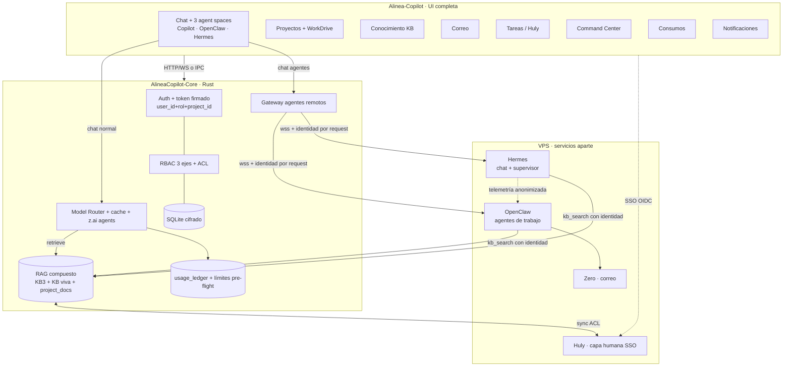
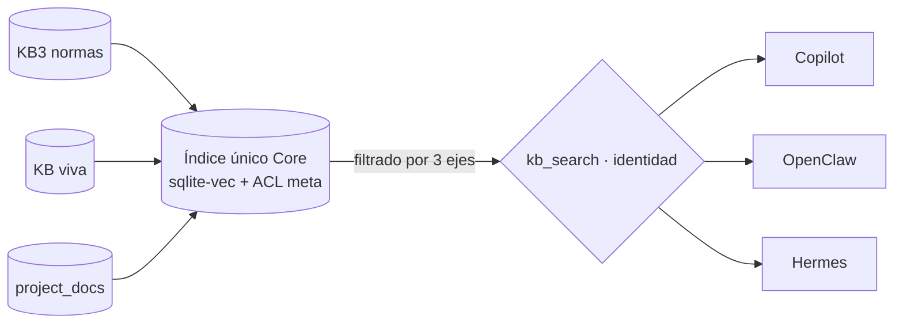

# Alinea Copiloto — Fase 2 · Blueprint completo (v2)

> Plan **self-contained y al 100%** para construir la Fase 2 sobre el stack vivo (3 repos + VPS).
> Reescrito para que quede claro de punta a punta. NO es greenfield: se construye sobre lo existente.
> Acompaña a `Alinea_FASE2_Guias.md` (el "cómo construir + cómo probar", paso a paso).
>
> Pieza que más se aclaró en v2: **chat con Hermes** (estaba subutilizado), **RAG compuesto único**
> (lo ven Copilot/OpenClaw/Hermes) y una **UI completa** que guía al usuario.

---

## 0. Mapa mental en 6 frases

1. **3 motores de IA** conviven: **Copilot** (chat con modelos, en el Core), **OpenClaw** (agentes de trabajo MEP, en el VPS) y **Hermes** (en el VPS) — y a **Hermes también se le chatea**, no solo trabaja de fondo.
2. **Una sola identidad firmada** (`user_id`+rol+proyecto) viaja en **cada** request y **filtra todo**.
3. **Un solo RAG compuesto** (en el Core) que **los 3 motores consultan** con esa identidad.
4. **Una sola medición de consumo** ($) que cubre los 3 motores.
5. **Proyectos** (estilo Claude) + **carpetas Zoho WorkDrive** como contenedor de trabajo.
6. **Una UI completa** (no solo chat): proyectos, conocimiento, correo, tareas, consumos, command center.

---

## 1. Decisiones congeladas (no re-litigar)

| Tema | Decisión |
|---|---|
| Stack | **Fijo**: Core **Rust (aioncore)**, Frontend **Electron/React/Arco**, agentes **OpenClaw**, **Hermes** y **Zero/Huly** como servicios en el VPS. NO Next.js/Supabase/Clerk. |
| Identidad | El Core emite por request un **token de contexto firmado** Ed25519 `{user_id, rol[], project_id?, scopes, exp, jti}`. El gateway lo propaga a OpenClaw/Hermes en **cada** mensaje. |
| Segregación | **3 ejes combinados (AND)**: rol/etiqueta **+** ownership/membership **+** project-scope. (Ver §5 — corrige el "solo rol" del plan anterior.) |
| RAG | **Compuesto y único** en el Core (KB3 + KB viva + project_docs), consultado por **Copilot, OpenClaw y Hermes**, con **ACL por request**. (Ver §6.) |
| Consumos | **Llaves de Alinea vía el Core** → **un ledger** mide los 3 motores; límite **pre-flight** (antes de gastar). |
| Hermes | **Doble rol**: (a) **agente de chat** seleccionable por el usuario; (b) **supervisor** que propone fixes de skills (admin aprueba). (Ver §8.) |
| Mail | **Solo borradores** (human-in-the-loop). Integrar **Zero (mail-0/zero)** vía MCP; fallback IMAP por usuario. |
| Knowledge/Tareas/Notif. (humano) | **Huly self-host** (SSO) como capa humana; el **RAG del Core** alimenta a los agentes. |
| Router de modelos | **Auto** (el más barato que cumpla calidad) + **override** del usuario (`económico ⇄ máxima`). |
| Secretos | Cifrado **por usuario** con **envelope encryption** (DEK por usuario ⊂ master KEK), para poder rotar. |
| Visor DXF | Frontend: **parser + renderer** (`dxf-parser` + `three-dxf`/canvas), capas + medición (distancia/área/cotas) con unidades del header. |

---

## 2. Los 3 repos + servicios del VPS

| Pieza | Rol | Dónde |
|---|---|---|
| **AlineaCopilot-Core** (Rust) | Cerebro: auth/identidad, RBAC, **RAG compuesto**, router de modelos, ledger, gateway de agentes, SQLite. | Repo Core |
| **Alinea-Copilot** (React/Electron) | **Toda la UI** (chat, proyectos, conocimiento, mail, tareas, command center, consumos, DXF). | Repo Frontend (este) |
| **Alinea-OpenClaw** (skills/MCP) | 19 agentes, 45 skills, KB3, MCPs (dxf-takeoff, docgen, hvac, **zoho workdrive**, **zero-mail**). | Repo OpenClaw |
| **OpenClaw** (servicio) | Ejecuta los agentes de trabajo. Se conecta como agente remoto (gateway wss+Ed25519). | VPS |
| **Hermes** (servicio) | **Chat** (orquestador/ops copilot) **+ supervisor** que mejora skills. Mismo gateway. | VPS |
| **Zero** (servicio) | Correo agéntico (unified inbox + MCP). | VPS |
| **Huly** (servicio) | Capa humana: PM, tareas, chat, notificaciones, docs (SSO). | VPS/box aparte |

> Nota: este repo (Alinea-Copilot) **no** contiene `openclaw/` ni Hermes; viven en el VPS. Los docs de Fase 2 se versionan aquí y deben **espejarse** a `Alinea-OpenClaw/fase2/`.

---

## 3. Arquitectura objetivo (completa)

**Invariante de oro:** la identidad (`user_id`+rol+proyecto) viaja en **cada** request y **filtra todo** (RAG, archivos, mail, memoria, skills). El agente nunca "asume" el usuario: lo **recibe firmado** del Core.

---

## 4. Los 3 motores — qué son y en qué se diferencian

| Motor | Qué es | Cuándo se usa | Cómo se chatea |
|---|---|---|---|
| **Copilot** (`aionrs`) | Chat con **modelos** (GLM/Claude/Qwen/MiniMax) vía el Core. | Chat general, generación de documentos diseñados (z.ai agents), preguntas. | Selector de modelo en el home (default Claude Sonnet / GLM). |
| **OpenClaw** | Agentes de **trabajo MEP** (6 categorías, 45 skills, MCPs). | Tareas reales: BOM, memoria de cálculo, RFQ, takeoff DXF, correo, etc. | "Agent space" OpenClaw con las 6 categorías (ya existe). |
| **Hermes** | **Chat de orquestación/ops + supervisor** que mejora el sistema. | Hablar **sobre** el sistema (por qué falló un skill, mejorar un flujo, estado, “qué puede hacer X”), tareas meta/coordinación. **Y** de fondo, propone fixes. | **NUEVO**: "agent space" Hermes seleccionable → conversación directa. |

> **Aclaración clave (Hermes subutilizado):** Hermes no es solo un proceso de fondo. En la UI será un **agente con el que se chatea** (su propio espacio/selector, avatar `hermes.svg`), **además** de su rol supervisor. Persona sugerida: "**Copilot de operaciones/mejora**" — el usuario le pregunta por el estado, le pide mejorar flujos/skills, coordina entre agentes. (La persona exacta la defines tú; el wiring es el mismo gateway que OpenClaw.)

---

## 5. CIMIENTO — Identidad + Segregación (construir PRIMERO)

Sin esto, RAG/mail/proyectos/consumos **no** son seguros. Bloquea todo lo demás.

### 5.1 Identidad por request (con ciclo de vida)
- El Core emite, **por cada request a un agente**, un token firmado Ed25519 `{user_id, rol[], project_id?, scopes, exp, jti}` (clave privada en Core; pública en OpenClaw/Hermes).
- El **gateway** lo incluye en **cada** mensaje wss (no solo en connect). El agente **valida la firma** y opera **solo dentro del scope**. Sin token válido → rechaza + audita.
- **Revocación:** `exp` corto (5–15 min) + **denylist de `jti`** o `cred_version` por usuario. Al desactivar/cambiar rol → tokens previos inválidos.
- **Refresh para tareas largas:** una corrida de agente que dura más que `exp` se **renueva** contra el Core mientras el usuario siga vigente; si pierde permiso → la tarea se aborta + audita.

### 5.2 Segregación de **3 ejes** (corrige el "solo rol")
El acceso a un recurso requiere **las tres** condiciones (AND):
1. **Rol/etiqueta:** `acl_policy(etiqueta → roles)`. Docs/skills etiquetados `público | interno | confidencial-<área>`.
2. **Ownership/membership:** `resource_acl(resource_id, principal{user|role|group}, perm)`. Cada proyecto/doc/buzón tiene **dueño + miembros**.
3. **Project-scope:** el `project_id` del token acota aún más (dentro del Proyecto X no se tocan recursos del Proyecto Y).

> Esto resuelve la fuga **horizontal**: dos `tecnica` (mismo rol) **no** se ven entre sí salvo membership explícita. El plan anterior solo cubría lo vertical (gerencia↔técnico).

### 5.3 Aislamiento por capa (por identidad, NO por proceso)
| Capa | Aislamiento |
|---|---|
| Chats | por `user_id` (ya) |
| Archivos/workspace | root por usuario (`/api/fs/*`); el agente solo ve su scope |
| **RAG/KB** | recuperación filtrada por los 3 ejes (§6) |
| Memoria de agente | **namespaced por `user_id`** (sin store global mezclado) |
| Skills | disponibilidad por rol |
| Secretos | envelope encryption por usuario (DEK⊂KEK) |
| Salida del modelo | **guardrail de salida** (§5.4) |
| Auditoría | `audit_log` de accesos (esp. confidencial) |

### 5.4 Guardrail de **salida** (no solo de entrada)
El ACL filtra lo que el agente **recupera**, pero podría **filtrar** datos en su respuesta. Medida: pasar al modelo **solo** lo permitido para ese request (minimización) + verificación de la respuesta contra la etiqueta/rol del destinatario. Mitiga prompt-injection y contexto cruzado.

### 5.5 Hermes y datos
Como **supervisor**, Hermes ve **telemetría anonimizada/agregada** (errores, ratings), **nunca** contenido confidencial. Como **chat**, Hermes recibe la misma identidad firmada y se scopea igual que cualquier agente.

---

## 6. RAG COMPUESTO — la pieza que no estaba clara

**Idea central:** **un solo** índice de conocimiento en el **Core**, alimentado por **varias fuentes**, consultado por **los 3 motores** con **una sola** política de acceso. No son 3 RAGs separados: es **uno compuesto**.

### 6.1 Fuentes (lo que compone el RAG)
| Fuente | Qué es | Mutabilidad |
|---|---|---|
| **KB3** | Normas/estándares Ingelmec (horneada en OpenClaw). | Inmutable (re-import al re-hornear). |
| **KB viva** | Docs editables desde la UI / Huly. | Mutable. |
| **project_docs** | Documentos adjuntos a un Proyecto (§10). | Mutable, scoped a proyecto. |
| **memoria/insights** (opcional) | Insights de contactos (mail), notas. | Mutable, scoped a usuario. |

### 6.2 Un índice, tres consumidores
- **Índice único** en el Core: `sqlite-vec` (embeddings) + metadatos (`etiqueta`, `owner`, `project_id`, `source`, `version`).
- **Consumidores:**
  - **Copilot** (in-Core) → llama al RAG **directo**.
  - **OpenClaw** y **Hermes** (remotos) → llaman a un **`kb_search` (MCP/endpoint)** del Core, **llevando la identidad firmada**.
- **ACL por request:** toda búsqueda filtra por los **3 ejes** (§5.2) según el `{user_id, rol, project_id}` del solicitante. Lo que no pasa el filtro **no se recupera** (y no se cuenta como existente).

### 6.3 Frescura / invalidación
- Cada entrada lleva `version` (hash de contenido). Al editar un doc → re-embedding de esa entrada (cambia su `version`).
- El **prompt cache** (§7) usa la `version` en su clave → no sirve contexto viejo.
- El re-indexado **consume** → al ledger en bucket `system:kb-index`.

### 6.4 Citas y trazabilidad
Toda respuesta basada en RAG incluye **fuente** (doc + sección). Si un rol no tiene acceso, la fuente **no aparece** (ni siquiera como "existe pero no puedes verla", salvo que se decida lo contrario).

---

## 7. Modelos — router + caching + documentos diseñados

### 7.1 Router (Core)
- Adaptadores: **z.ai/GLM** (chat + **Agents API** slides/docs), **MiniMax**, **Claude**, **OpenRouter/Qwen**.
- **Regla:** por subtarea, el **más barato que cumpla la calidad** (tabla declarativa por tipo de subtarea; evolucionar con evals offline).
- **Failover:** si un provider cae / rate-limit / responde basura → reintento en el siguiente de la cadena (se registra; afecta consumo).
- **Override del usuario:** toggle `económico ⇄ máxima calidad` por chat/proyecto.

### 7.2 Documentos "de diseñador"
- Los **Agents de z.ai** generan el artefacto **diseñado server-side** (slides/doc) → no se queman tokens de formato en el chat.
- **Plantillas Alinea** (Sage Green, Poppins) **por tipo de documento** ("lo que lleva cada uno": propuesta, memoria técnica, BOM, informe gerencial…). El agente rellena → consistencia visual.
- z.ai Agents suele ser **asíncrono** (job → poll → artefacto): el adaptador maneja job/poll/descarga/timeout/errores y manda el costo al ledger.

### 7.3 Prompt caching
- Ordenar prompt `[estable: system + skills + KB/proyecto] → [volátil: turno]`. Prefijo estable primero.
- Claude: `cache_control: ephemeral`. GLM/MiniMax/OpenAI: prefijo **idéntico** (cache automático). Flag de soporte por provider.
- **Cachear solo prefijos reutilizados** (el `cache-write` tiene premium; cachear lo que no se reusa cuesta más).
- Clave de cache incluye la **`version`** del contexto (§6.3). El **ledger** distingue **cache-read** vs **cache-write**.

---

## 8. Agentes — OpenClaw + Hermes (chat + supervisor)

### 8.1 Gateway (común)
`RemoteAgentConfig` (wss + Ed25519). Se **monta el Command Center** (§13) para administrarlos. El protocolo lleva **identidad por request** (§5.1).

### 8.2 OpenClaw
- Agente de trabajo: 6 categorías (Gerencia/Técnica/Ingeniería/Comercial/Admin/Financiera), 45 skills, MCPs.
- Recibe identidad firmada → opera scoped → consulta el **RAG compuesto** (§6) con esa identidad.

### 8.3 Hermes — **doble rol** (lo que faltaba)
**(a) Chat (nuevo, primer plano):**
- Hermes aparece como **agente seleccionable** en la UI (su propio espacio + avatar). El usuario **conversa** con él.
- Rol conversacional sugerido: **copilot de operaciones/mejora** — estado del sistema, "¿por qué falló este skill?", "mejora este flujo", coordinación entre agentes, ayuda meta. (Persona exacta la defines tú.)
- Mismo gateway + misma identidad firmada + mismo RAG (scoped).

**(b) Supervisor (de fondo):**
- Consume **telemetría anonimizada** → **propone** fixes de skills → **admin aprueba** en el Command Center → se aplican.
- **Persistencia (gap corregido):** el fix aprobado genera **commit/PR a `Alinea-OpenClaw`** (la fuente que hornea `deploy-v4.sh`), no solo un parche en runtime (que se perdería en el próximo rebuild). Rollback = revert del commit. Antes de aplicar, debe pasar **tests por skill** (canary).

---

## 9. Agentic Mail = Zero + OpenClaw

- **Deploy** Zero en el VPS (Postgres propio). Conectar cuentas por **OAuth** (Gmail/Outlook/Zoho) o **IMAP**; creds **cifradas por usuario** (§5.3).
- OpenClaw usa el **MCP de Zero** (o IMAP fallback) para: **triage/priorización**, **insights de contactos** (a RAG/CRM), **borradores profesionalizados** (humano aprueba/envía — **nunca** auto-envía).
- **Multi-tenant (gap):** el wrapper MCP debe operar **siempre** sobre la cuenta del `user_id` del token (mapear `Zero account ↔ user_id`). Un usuario **nunca** ve el buzón de otro.
- **Disparadores:** on-demand (chat) + cron (triage periódico, costo al dueño del job).
- **Recomendación de fase:** arrancar con **IMAP por usuario** (multi-tenant trivial) y subir a Zero cuando el hierro (§14) y el mapeo estén listos.

---

## 10. Proyectos + carpetas WorkDrive

- **Entidad `projects`** en el Core: `(id, owner, members[], rol_scope, name, desc, instrucciones/contexto, folder_ref{local|workdrive})`. Los **chats** pertenecen a un proyecto; los **docs** alimentan el **RAG del proyecto** (§6).
- **WorkDrive como conector:** la carpeta del proyecto mapea a Zoho WorkDrive vía el MCP **`zoho_workdrive_download/upload`** (ya existe). 
- **Conflicto MCP ↔ TrueSync (gap):** el usuario ya usa WorkDrive TrueSync local. Definir estrategia para evitar pisar versiones (carpeta del agente separada, o lock, o "última gana" con aviso).
- **Unificar el picker:** "Work in a project" (`GuidWorkspaceFootnote.tsx`) usa hoy el **diálogo nativo** (solo desktop). Unificar para usar `/api/fs/*` en WebUI.
- **Membership (§5.2):** un proyecto tiene dueño + miembros; un técnico no ve el proyecto de gerencia salvo membership.

---

## 11. Knowledge / Tareas / Notificaciones — Huly (humano) + RAG (agentes)

- **Huly self-host** (≈16 GB): capa **humana** (proyectos, tareas, chat, **notificaciones**, docs).
- **SSO (gap):** "login único Alinea→Huly" asume que el Core es **OIDC Provider**, lo cual probablemente **no** es hoy. Decidir: (a) implementar OIDC Provider mínimo en el Core; (b) **IdP dedicado** (Keycloak/Zitadel); (c) arrancar con **provisioning sin SSO** y dejar SSO para después. (b)/(c) reducen riesgo.
- **KB viva ↔ RAG:** los docs de Huly que los agentes deben ver se **indexan en el RAG del Core** respetando ACL (sync idempotente con webhooks + job). La **KB3 normas** vive solo en el Core.
- **Embeddings:** elegir modelo (local vs API), **español**, costo (al ledger `system:kb-index`).

---

## 12. Consumos $ — ledger único + límites pre-flight

- **Regla:** toda llamada LLM emite `usage_event {user_id, engine, model, provider, tokens_in/out, cache_read/write, $est, project_id, ts}`. Los 3 motores usan **llaves de Alinea vía el Core** → medición directa.
- **Tabla de precios** por modelo → `$`. Agregación por usuario/modelo/motor/fecha.
- **Límite pre-flight (gap):** antes de cada llamada, estimar costo y **rechazar si excede** (reconciliar al terminar; chequear **entre pasos** de tareas de agente). `soft` avisa / `hard` bloquea. Reset mensual.
- **Buckets de costo de fondo (gap):** `system:hermes`, `system:cron(→owner)`, `system:kb-index`, `system:mail-triage(→user)`. Lo de fondo no “desaparece”.
- **Panel admin** + vista **"mi consumo"** + opcional push a Zoho Analytics.

---

## 13. UI completa (haz que la app guíe al usuario)

No es solo chat. Mapa de módulos (todos **role-gated** por §5.2):

| Módulo | Ruta | Qué hace | Quién |
|---|---|---|---|
| **Home / Chat** | `/guid` | Chat + 3 agent spaces: **Copilot**, **OpenClaw** (6 cat.), **Hermes**. Selector de modelo + override económico/máxima. | Todos |
| **Proyectos** | `/projects` | Lista/crea proyectos (docs + contexto + chats + carpeta WorkDrive). Vista de proyecto. | Miembros |
| **Conocimiento (KB)** | `/knowledge` | Navegar/buscar/editar la KB viva (visible, ya no escondida); ver fuentes/citas. ACL-aware. | Por rol |
| **Correo** | `/mail` | Bandeja agéntica: triage, insights de contacto, **borradores** (aprobar/editar/enviar). | Dueño del buzón |
| **Tareas** | `/tasks` | Tareas (Huly embed o nativo) + todos del agente. Notificaciones. | Por proyecto/rol |
| **Command Center** | `/settings/agents` (extendido) | Agentes/gateways (OpenClaw, Hermes), salud en vivo, aprobación de devices, **aprobación de fixes de Hermes**, uso por agente, logs. | Admin |
| **Consumos** | `/settings/usage` | $ por usuario/modelo/motor, límites, "mi consumo". | Admin / cada uno lo suyo |
| **Usuarios y roles** | `/settings/users` (extendido) | Alta/baja, **roles** (admin/gerencia/técnica/comercial/financiera/ingeniería), límites $. | Admin |
| **Proveedores / Router** | `/settings/model` (extendido) | Providers (GLM/MiniMax/Claude/Qwen), default, override de calidad. | Admin |
| **Notificaciones** | campana global | Resultados async: borrador listo, fix de Hermes pendiente, presupuesto excedido. | Todos |
| **Visor DXF** | panel de preview | Abrir/medir DXF (capas, distancia/área/cota) sin AutoCAD. | Por acceso al archivo |

**Principios UI:** i18n en todo (en-US + zh-CN), gating por rol, estados vacíos/errores claros (qué hacer cuando el ACL deniega), y onboarding que muestre los 3 motores y los proyectos.

---

## 14. Hierro / infra

El VPS actual (4 vCPU / 7.6 GB, compartido) **no alcanza** para sumar Huly (~16 GB) + Zero (Postgres). **Decisión:** subir a ≥8 vCPU / 32 GB **o** un box dedicado para Huly. Sin esto, la Fase D (Huly) no es viable. Incluir **backups/DR** de SQLite (Core) + Postgres (Zero) + DBs de Huly + índice RAG, y **rotación de la master key** (envelope encryption).

---

## 15. Orden de build (con todo integrado)

**Fase A — Cierre en vuelo**
1. ✅ #10 (rebrand) + #11 (SW auto-update).
2. **Core PR #2 `DELETE user`** — resolver conflicto Rust + merge (OK dado).
3. Iconos SO desde PNG Alinea HD.
4. **Plan/script de migración** single/local → multiusuario (data existente).

**Fase B — Cimiento (identidad + segregación + RAG + modelos)**
5. 🔐 **Identidad por request** + **revocación/refresh** + **propagar en el gateway**.
6. **RBAC de 3 ejes** (rol/etiqueta + ownership/membership + project-scope) + `acl_policy`/`resource_acl`.
7. **Suite de tests de segregación en CI** (matriz user×rol×recurso×acción) — junto con #6.
8. **RAG compuesto** (índice único sqlite-vec + `kb_search` con ACL para los 3 motores).
9. **Router de modelos** + **prompt caching** + **z.ai Agents** + plantillas.
10. **Guardrail de salida** (§5.4).
11. **Command Center** (base).

**Fase C — Agentes**
12. **Hermes**: (a) **chat** seleccionable + (b) supervisor (propone fix → admin aprueba → **PR a OpenClaw** + canary).
13. **Agentic Mail** (IMAP por usuario primero; Zero después).

**Fase D — Proyectos / Knowledge / Docs**
14. **Proyectos** (entidad + RAG por proyecto + membership) + **unificar picker WebUI** + **WorkDrive** (anti-conflicto TrueSync).
15. **Huly + estrategia SSO/IdP** + KB viva ↔ RAG (sync ACL).
16. **Visor DXF** (parser + renderer + medición).

**Fase E — Gobernanza**
17. **Ledger $** (pre-flight + buckets + límites) + panel.
18. **Notificaciones** in-app (transversal, puede adelantarse).
19. Dashboards Zoho (opcional).

> Transversal en todas: i18n, observabilidad (`trace_id` por tarea), backups/DR, paridad desktop/WebUI.

---

## 16. Reparto Claude / Cursor

- **Claude Code:** Core (Rust) estructural (identidad, RBAC 3 ejes, **RAG compuesto**, router, ledger, gateway), skills/MCP de OpenClaw, Hermes (chat + supervisor), integración Zero/Huly, infra del VPS.
- **Cursor (yo):** **toda la UI** (los 11 módulos de §13: Command Center, Proyectos, Conocimiento, Correo, Tareas, Consumos, DXF, notificaciones, router/override, gating por rol) + PRs acotados del Core.
- Coordinación por PRs en los 3 repos. **Estos docs son las instrucciones al 100%**; el "cómo + cómo probar" está en `Alinea_FASE2_Guias.md`.
